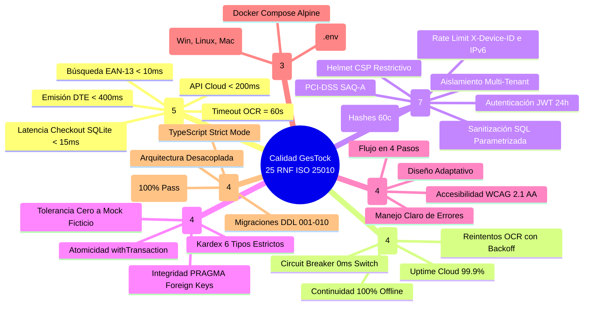
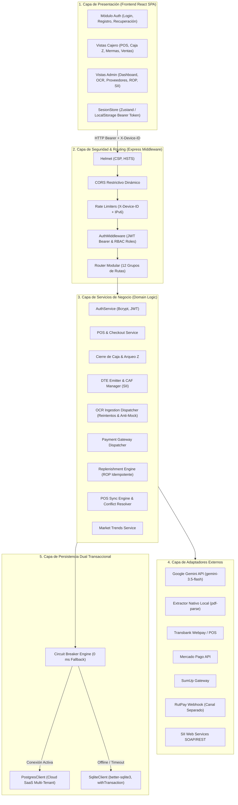
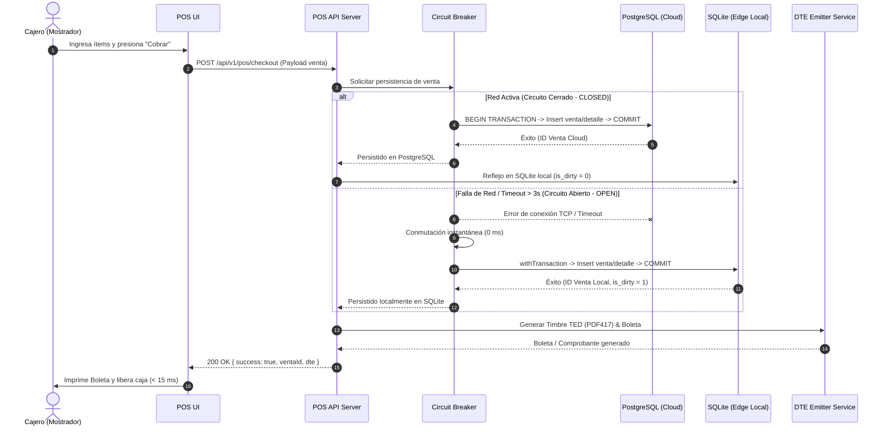
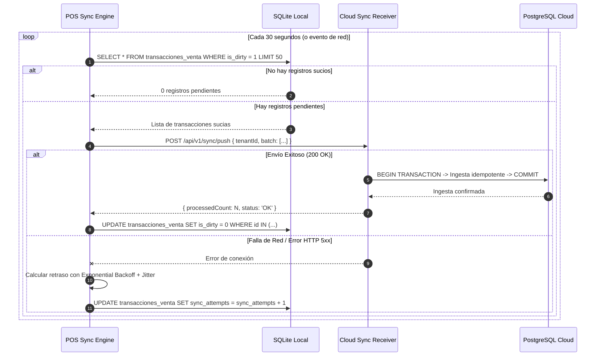
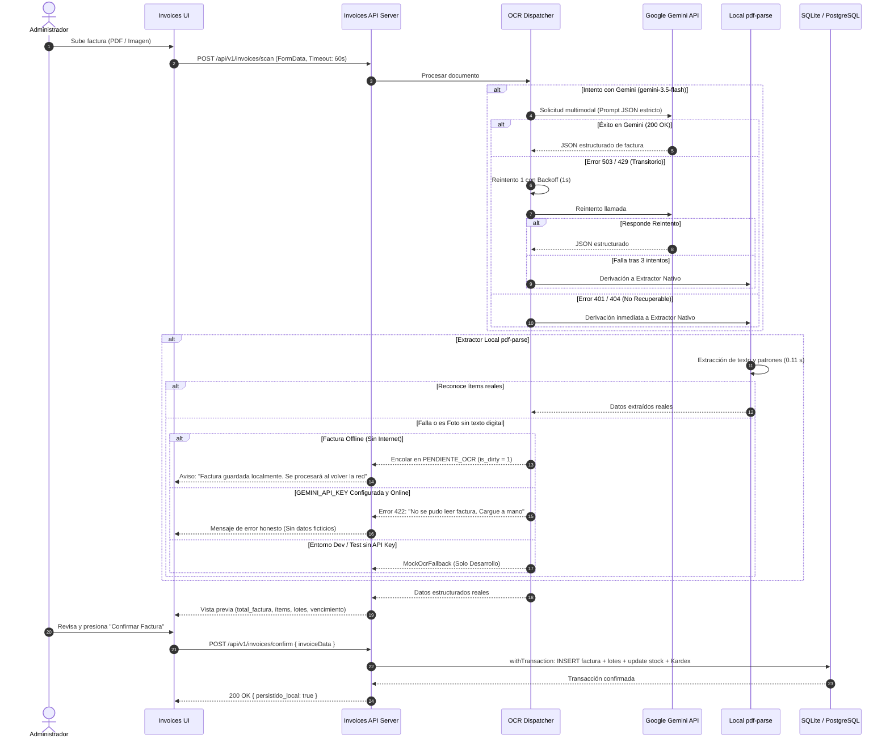
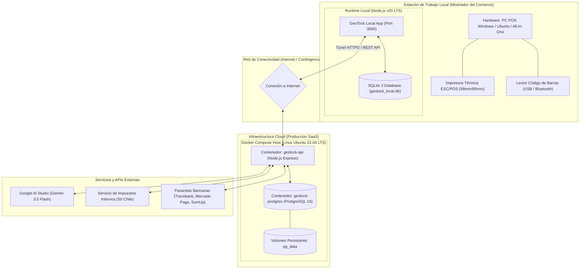

# 🏗️ GesTock — Documento de Arquitectura de Software (DAS)

#arquitectura #backend #gestock #offline-first #database #sii #dte #iso25010 #rup #rbac #gemini #circuit-breaker #mer

---

## Ficha Técnica del Documento

| Campo | Detalle Técnico |
|---|---|
| **Proyecto** | **GesTock** — Sistema Inteligente de Gestión de Inventarios & POS Offline-First |
| **Asignatura / Contexto** | Proyecto Aplicado de Título (APT — PTY4614), Duoc UC |
| **Versión del Documento** | 2.2 (Edición Integral Definitiva — Restauración Completa de Vistas 4+1, 25 RNF ISO 25010 y 29 Tablas Relacionales) |
| **Fecha de Emisión** | Octubre 2026 |
| **Líder de Proyecto / Arquitectura & Backend** | **Marcelo Alejandro Pino Valverde** |
| **Desarrollador Frontend / Diseñador UX-UI** | **David Miranda Tobar** |
| **Metodología de Desarrollo** | RUP (Rational Unified Process) iterativa, evolutiva y guiada por riesgos |
| **Estándar Arquitectónico** | Modelo de Vistas 4+1 de Philippe Kruchten & ISO/IEC 25010 (Calidad de Software) |
| **Estado del Documento** | Aprobado / Sincronizado con Repositorio Git y Bóveda Central de Conocimiento |

---

## 1. Introducción y Objetivos del Sistema

### 1.1 Propósito
El propósito fundamental de este documento es formalizar la arquitectura de software de **GesTock**, detallando su estructura lógica, física, de datos y de procesos, así como la especificación exhaustiva de sus **Requisitos Funcionales (RF)** y los **25 Requisitos No Funcionales (RNF)** bajo el estándar internacional **ISO/IEC 25010**. 

Este artefacto constituye la pieza central de ingeniería del software para la defensa de título y el desarrollo evolutivo del sistema, integrando las 4+1 vistas de Kruchten, los modelos matemáticos de resiliencia y el modelado de datos sobre **29 tablas relacionales**.

### 1.2 Contexto del Problema y Justificación
El comercio minorista independiente en Chile (minimarkets, almacenes de barrio, panaderías y botillerías) enfrenta tres barreras operativas críticas:
1. **Pérdida directa de ventas por fallas de conectividad:** Las soluciones POS tradicionales 100% en la nube se paralizan ante interrupciones de internet o caídas de enlaces móviles, dejando al cajero sin posibilidad de cobrar, emitir comprobantes o registrar ventas, lo que genera pérdidas económicas directas y fuga de clientes.
2. **Alta fricción en la recepción de mercadería:** El ingreso manual de facturas de compra de múltiples proveedores (distribuidores de bebidas, abarrotes, lácteos, cecinas) se realiza de forma manual en libretas o planillas Excel, lo que consume horas de trabajo diario y genera errores en la actualización de costos, existencias y márgenes de ganancia.
3. **Complejidad tributaria, normativa sanitaria y seguridad:** Obligación de emitir Documentos Tributarios Electrónicos (Boletas DTE 39, Facturas DTE 33) con Timbre Electrónico DTE (TED), cálculo diario del Reporte de Consumo de Folios (RCOF) para el Servicio de Impuestos Internos (SII), aplicación estricta de la Ley de Redondeo en efectivo (Ley N° 20.956), trazabilidad sanitaria FEFO de alimentos perecibles (D.S. 977/96 MINSAL) y control de acceso basado en roles (RBAC) con protección perimetral.

### 1.3 Alcance de la Solución
**GesTock** implementa una arquitectura híbrida **Dual-Core (Cloud SaaS Multi-Tenant + Edge POS Offline-First)**:
* En **la nube**, centraliza la reportería ejecutiva, consolidación de compras, autenticación perimetral, monitoreo de tendencias de mercado (Mercado Libre, AliExpress) y respaldo tributario.
* En **el mostrador (borde local)**, ejecuta una terminal autónoma sobre **SQLite 3**, garantizando cobros en menos de 15 ms, conmutación automática en 0 ms (*Circuit Breaker*) y sincronización asíncrona bidireccional resiliente (*Exponential Backoff con Jitter*).

### 1.4 Glosario de Términos y Acrónimos Técnicos
* **DTE:** Documento Tributario Electrónico (Chile).
* **TED:** Timbre Electrónico DTE (código de barras bidimensional PDF417 según formato XML del SII).
* **CAF:** Código de Autorización de Folios (archivo XML firmado digitalmente otorgado por el SII).
* **RCOF:** Reporte de Consumo de Folios (reporte diario consolidado de boletas para el SII).
* **FEFO:** *First Expired, First Out* (Primero en Vencer, Primero en Salir).
* **ROP:** *Reorder Point* (Punto de Reorden de Inventario).
* **RBAC:** *Role-Based Access Control* (Control de Acceso Basado en Roles).
* **Circuit Breaker:** Patrón de diseño de resiliencia que interrumpe solicitudes a servicios caídos para evitar sobrecarga o bloqueos de interfaz.
* **Offline-First:** Filosofía arquitectónica donde la persistencia local es la fuente primaria e inmediata de operaciones, sincronizando asíncronamente con la nube.
* **LWW:** *Last-Write-Wins* (Estrategia de resolución de conflictos de datos basada en marcas temporales).
* **ILA:** Impuesto Adicional a las Bebidas Alcohólicas y Analcohólicas (Chile).
* **MER:** Modelo Entidad-Relación.

---

## 2. Requisitos Funcionales del Sistema (RF)

Los requisitos funcionales han sido identificados, clasificados por módulo operativo y priorizados según la metodología RUP (Crítica / Alta / Media / Baja).

### 2.1 Módulo 1: Autenticación & Control de Acceso (RBAC)
> [!NOTE]
> **Estado de Implementación:** Implementado y verificado. El módulo cuenta con rutas de autenticación perimetral (`/api/v1/auth/login`, `/register`, `/me`), generación y verificación criptográfica JWT (`jsonwebtoken`, expiración 24h) y almacenamiento de claves cifradas mediante Bcrypt (`bcryptjs`, work factor 10) con suite de pruebas automatizadas aprobadas.

| ID | Requisito Funcional | Descripción y Reglas de Negocio | Prioridad |
|---|---|---|---|
| **RF-01** | Inicio de Sesión Seguro (Login JWT) *[Objetivo Fase 2]* | Autenticación mediante `tenant_id`, `email` y `password`. El sistema genera y retorna un token JWT firmado (`HS256`, expiración 24h) y los datos del usuario. Manejo unificado de error 401 (*"El correo o la clave no son correctos"*) para evitar ataques de enumeración. El campo `password_hash` jamás se expone. | **Crítica** |
| **RF-02** | Registro Administrativo de Usuarios (Personal del Local) *[Objetivo Fase 2]* | Creación de cuentas restringida a administradores autenticados desde el panel de Configuración ("Personas del local"). Permite ingresar nombre, email, contraseña (encriptada con Bcrypt costo 10) y rol (`admin` o `cajero`). Detección de duplicados `UNIQUE(tenant_id, email)` (HTTP 409). Retorna HTTP 201 con el usuario creado sanitizado (sin token ni apertura de sesión automática para preservar la sesión del admin). | **Crítica** |
| **RF-03** | Verificación de Sesión Activa (`/auth/me`) y Lista de Personal (`/auth/users`) *[Objetivo Fase 2]* | Endpoint `GET /api/v1/auth/me` para verificar validez del token JWT y recuperar datos del usuario en recargas. Endpoint `GET /api/v1/auth/users` (restringido a rol `admin`) para auditar la nómina de usuarios del local sin exponer hashes de contraseñas. | Alta |
| **RF-04** | Matriz de Roles y Vistas (RBAC) | Restringir el acceso según el rol del usuario: <br>• **Rol `cajero` (6 vistas):** Caja POS, Notificaciones, Inventario (consulta y mermas), Cierre de Caja Z, Historial de Ventas y Configuración Básica (tema visual/apariencia).<br>• **Rol `admin` (11 vistas):** Acceso total (las 6 del cajero + Panel Dashboard, Facturas OCR, Proveedores, Reposición ROP, Respaldo SII y Configuración Global del Negocio). | **Crítica** |
| **RF-05** | Middleware de Protección Perimetral *[Objetivo Fase 2]* | Validar token JWT en todas las rutas bajo `/api/v1/*` (excepto `/auth/login`, `/health` y `/api`). En producción (`NODE_ENV=production`), la autenticación se exige de forma obligatoria por defecto para cerrar el perímetro de red; en desarrollo se activa con `ENFORCE_AUTH=true` (con interruptor de emergencia `AUTH_DISABLED=true` para pruebas locales). Rutas administrativas (`/dashboard`, `/invoices/*`, `/suppliers/*`, `/replenishment/*`, `/dte/*`, `/config/*`, `/auth/register`, `/auth/users`) protegidas por verificación estricta de rol `admin` (HTTP 403 a rol cajero). | **Crítica** |

### 2.2 Módulo 2: Punto de Venta (POS) & Checkout de Mostrador
| ID | Requisito Funcional | Descripción y Reglas de Negocio | Prioridad |
|---|---|---|---|
| **RF-06** | Búsqueda Instantánea de Productos | Localización de productos por código de barras (EAN-13, CODE-128) o texto (nombre, categoría) con latencia < 15 ms sobre el catálogo local. | **Crítica** |
| **RF-07** | Gestión de Carrito de Compras | Permitir agregar, modificar cantidades, aplicar descuentos porcentuales autorizados y remover ítems del carrito en tiempo real, recalculando subtotales e IVA (19%). | **Crítica** |
| **RF-08** | Checkout Multi-Método de Pago | Procesar transacciones combinando múltiples formas de pago en una sola venta (Efectivo, Débito/Crédito, QR, RutPay). | **Crítica** |
| **RF-09** | Aplicación Estricta de Ley de Redondeo (Ley N° 20.956) | El redondeo a la decena rige **exclusivamente para pagos en EFECTIVO** (saldo terminado en 1 a 4 redondea hacia abajo; terminado en 5 a 9 redondea hacia arriba). Todos los pagos electrónicos (tarjetas, transferencias, RutPay) registran y cobran el monto exacto. | **Crítica** |
| **RF-10** | Emisión Inmediata de Boleta / Comprobante | Generar comprobante de venta fiscal o ticket interno con desglose de ítems, subtotal, IVA, vuelto entregado y código de verificación. | **Crítica** |
| **RF-11** | Cobro Estandarizado de Bolsas Reutilizables | Integrar botón de acceso rápido para agregar cobro normativo de bolsas reutilizables (Ley N° 21.100) tarifadas a valor parametrizable ($1.000). | Media |
| **RF-12** | Devoluciones y Anulación de Ventas | Registrar devoluciones parciales o totales de ítems mediante `POST /pos/devolucion`, marcando la transacción con `es_devolucion = 1`, asociando `referencia_venta_id` y emitiendo Nota de Crédito DTE 61 con reposición de inventario. | Alta |
| **RF-13** | Registro y Clasificación de Mermas | Permitir al operador registrar pérdidas por mercadería dañada o vencida mediante `POST /pos/mermas`, descontando stock atómicamente y registrando motivo y usuario responsable. Exportación a CSV. | Alta |
| **RF-14** | Consulta de Historial de Transacciones | Visualizar ventas de la sesión con soporte para campos `es_devolucion`, `referencia_venta_id`, `producto_id`, `rut_cliente` y estado de sincronización (`is_dirty`). | Media |
| **RF-15** | Atajos de Teclado Operativos | Proveer accesos rápidos vía teclado (`F2` cobrar, `F4` cancelar, `Enter` confirmar, `Esc` limpiar) para acelerar la atención en mostrador. | Alta |

### 2.3 Módulo 3: Control de Caja & Arqueo Z
| ID | Requisito Funcional | Descripción y Reglas de Negocio | Prioridad |
|---|---|---|---|
| **RF-16** | Apertura Formal de Turno de Caja | Registrar la apertura de caja indicando monto inicial de fondo en efectivo (sencillo), fecha/hora, terminal y cajero responsable. | **Crítica** |
| **RF-17** | Registro de Movimientos de Efectivo | Permitir registrar ingresos extraordinarios (inyección de cambio) y egresos de efectivo (pago a repartidor, retiro parcial de seguridad). | Alta |
| **RF-18** | Arqueo Ciego / Declaración de Caja | En el momento del cierre, el cajero debe ingresar el conteo físico de billetes y comprobantes sin conocer el saldo teórico del sistema (*arqueo ciego*). | Alta |
| **RF-19** | Balance Z y Cálculo de Descuadraturas | Calcular automáticamente la diferencia entre el saldo teórico acumulado y el efectivo declarado, identificando sobrantes o faltantes. RutPay y pagos electrónicos se concilian en canales independientes de la gaveta de efectivo. | **Crítica** |
| **RF-20** | Desglose de Impuesto ILA en Turno | Incluir en el resumen de caja el desglose totalizado del impuesto adicional `monto_ila` generado en las ventas de bebidas y licores del turno. | Media |
| **RF-21** | Historial de Cierres de Caja | Almacenar y listar los cierres de caja históricos con desglose por medio de pago (Efectivo, Débito, Crédito, RutPay, QR) para auditoría contable. | Media |
| **RF-22** | Impresión de Reporte Z | Formatear el informe de cierre Z para impresoras térmicas ESC/POS de 58 mm y 80 mm. | Media |

### 2.4 Módulo 4: Gestión de Inventario, Lotes y Kardex FEFO
| ID | Requisito Funcional | Descripción y Reglas de Negocio | Prioridad |
|---|---|---|---|
| **RF-23** | Control de Stock Físico Multitienda | Mantener el balance de unidades físicas por producto con soporte para inventario local en mostrador y almacén central. | **Crítica** |
| **RF-24** | Trazabilidad por Lotes y Vencimientos | Asociar cada partida ingresada con número de lote y fecha de expiración, implementando política FEFO (*First Expired, First Out*) según D.S. 977/96 MINSAL. | **Crítica** |
| **RF-25** | Semáforo Preventivo de Vencimientos | Alertar visualmente productos según proximidad de caducidad: Rojo (< 7 días), Amarillo (8 a 30 días), Verde (> 30 días). | Alta |
| **RF-26** | Kardex Transaccional Atómico (6 Tipos) | Auditar cada variación de existencias en `historial_stock` validando los 6 tipos de movimiento soportados: `'venta'`, `'ingreso_factura'`, `'ajuste'`, `'alta_inicial'`, `'ajuste_manual'` y `'merma'`. | **Crítica** |
| **RF-27** | CRUD Completo de Productos en Inventario | Permitir crear (`POST /pos/products`), editar (`PUT /pos/products/:id`) y ajustar existencias (`PATCH /pos/products/:id/stock`), encapsulando todas las escrituras en transacciones atómicas (`withTransaction`) para prevenir inconsistencias. | **Crítica** |
| **RF-28** | Directorio de Proveedores | Administrar ficha de proveedores con validación de RUT chileno con dígito verificador (módulo 11), razón social, giro, teléfono, email y condiciones comerciales. | Media |

### 2.5 Módulo 5: Facturación Electrónica DTE & Cumplimiento SII
| ID | Requisito Funcional | Descripción y Reglas de Negocio | Prioridad |
|---|---|---|---|
| **RF-29** | Configuración Tributaria del Emisor | Administrar RUT emisor válido, razón social, giro, dirección casa matriz, código de actividad económica y certificado digital X.509 (.p12/.pfx). | **Crítica** |
| **RF-30** | Carga y Validación de Folios CAF | Importar archivos XML de CAF otorgados por el SII, validando la firma digital de la autoridad tributaria y el rango de folios asignado. | **Crítica** |
| **RF-31** | Control Secuencial Estricto de Folios | Asignar correlativamente los folios consumidos sin huecos ni duplicados para Boleta Electrónica (39/41) y Factura Electrónica (33/34). | **Crítica** |
| **RF-32** | Generación de XML DTE y Firma RSA | Construir el XML canónico conforme a las especificaciones técnicas del SII y firmar criptográficamente el nodo `<Documento>` mediante RSA-SHA1. | **Crítica** |
| **RF-33** | Generación del Timbre Electrónico DTE (TED) | Construir la cadena `<TED>` con datos de control y firma del CAF, renderizando el código de barras bidimensional PDF417 para la boleta térmica. | **Crítica** |
| **RF-34** | Emisión de Guías de Despacho (Tipo 52) | Emitir guías electrónicas para traslado no constitutivo de venta o entrega diferida de mercadería. | Media |
| **RF-35** | Reporte Diario de Consumo de Folios (RCOF) | Generar automáticamente el archivo RCOF que resume las boletas emitidas offline durante el día para su envío nocturno al SII (Res. Ex. 74/2020). | **Crítica** |
| **RF-36** | Pre-Cálculo de F29 (IVA Débito/Crédito) | Consolidar ventas y compras del periodo tributario para predecir el impuesto IVA a pagar en el formulario mensual F29. | Alta |
| **RF-37** | Set de Certificación SII | Ejecución de Set de Pruebas de Certificación requerido por el SII para habilitación de software propio (Res. 74). | Alta |

### 2.6 Módulo 6: Ingestión Inteligente de Facturas con IA / OCR
| ID | Requisito Funcional | Descripción y Reglas de Negocio | Prioridad |
|---|---|---|---|
| **RF-38** | Carga Multiformato de Facturas | Subida de facturas de proveedores en formato PDF vectorial, PDF escaneado o imágenes (JPG, PNG). | **Crítica** |
| **RF-39** | Extracción Multimodal con Gemini OCR | Procesar facturas mediante **Google Gemini** (modelo `gemini-3.5-flash` o `GEMINI_MODEL`), extrayendo en JSON estricto: RUT Proveedor, Folio, Razón Social, Fecha, Ítems, Lote, Vencimiento, Costos y Totales. Timeout de escaneo ampliado a 60 segundos. | **Crítica** |
| **RF-40** | Reintentos Inteligentes en Falla OCR | Aplicar hasta 3 reintentos con retraso progresivo (1s, 2s) ante errores recuperables (HTTP 503, HTTP 429) antes de derivar a fallback. Ante errores definitivos (401, 404), corte inmediato al extractor nativo. | Alta |
| **RF-41** | Extractor Nativo de Respaldo (`pdf-parse`) | En ausencia de internet o ante falla de API, activar analizador local determinista de texto PDF para extracción en 0.11 segundos. | Alta |
| **RF-42** | Política Estricta Anti-Datos Ficticios | Si `GEMINI_API_KEY` está configurada y ambos motores reales fallan, el sistema responde error `422 Unprocessable Entity` y solicita ingreso manual, **prohibiendo** la generación de facturas ficticias inventadas por el simulador para proteger el inventario. | **Crítica** |
| **RF-43** | Ingesta de Facturas Offline-First | Las facturas digitales se leen localmente sin red. Las fotos/escaneos sin texto se encolan en estado `PENDIENTE_OCR` (`is_dirty = 1`) para su procesamiento con Gemini cuando se restablezca la conectividad. | Alta |
| **RF-44** | Pantalla de Confirmación y Actualización Atómica | Interfaz para verificar datos extraídos y confirmación atómica (`POST /invoices/confirm`) con soporte dual de campos `total_factura` / `total`, garantizando `persistido_local = true`, creación de lotes y actualización de Kardex. | **Crítica** |

### 2.7 Módulo 7: Reabastecimiento Predictivo (ROP) & Órdenes de Compra
| ID | Requisito Funcional | Descripción y Reglas de Negocio | Prioridad |
|---|---|---|---|
| **RF-45** | Consulta Pura e Idempotente de ROP | `GET /api/v1/replenishment/suggest` calcula en memoria la velocidad diaria de venta ($V_d$), el Punto de Reorden ($ROP$) y sugerencias de compra de forma **estrictamente de sólo lectura**, sin escribir filas en `purchase_orders`. | **Crítica** |
| **RF-46** | Persistencia Formal de Órdenes de Compra | `POST /api/v1/replenishment/suggest` registra formalmente las órdenes de compra en la base de datos cuando el usuario decide confirmar el pedido sugerido. | Alta |
| **RF-47** | Despacho de Órdenes por Correo Electrónico | Generación de orden de compra en PDF y envío automatizado al correo del proveedor registrado. | Media |
| **RF-48** | Proyección de Agotamiento de Inventario | Estimar los días restantes antes de que un producto alcance stock cero según tendencia de ventas. | Media |

### 2.8 Módulo 8: Pasarelas de Pago, Tendencias de Mercado & Sincronización
| ID | Requisito Funcional | Descripción y Reglas de Negocio | Prioridad |
|---|---|---|---|
| **RF-49** | Despachador de Pasarelas de Pago | Patrón *Dispatcher* para enrutar pagos hacia: Transbank Webpay Plus, Mercado Pago, SumUp y RutPay con sandbox simulado de contingencia. | **Crítica** |
| **RF-50** | Seguridad PCI-DSS SAQ-A | Prohibición absoluta de almacenar números PAN completos, CVV o PIN de tarjetas en base de datos. | **Crítica** |
| **RF-51** | Tendencias de Mercado (ML & AliExpress) | Obtener referencias de precios de mercado en Mercado Libre Chile y AliExpress para sugerencia de margen competitivo. | Media |
| **RF-52** | Detección de Transacciones Sucias (`is_dirty`) | El motor local de SQLite marca cada venta, merma o ajuste con `is_dirty = 1` y contador `sync_attempts`. | **Crítica** |
| **RF-53** | Transmisión con Exponential Backoff y Jitter | Sincronización asíncrona hacia la nube con reintentos escalonados para evitar congestión de red. | **Crítica** |
| **RF-54** | Receptor Cloud Idempotente | `POST /api/v1/sync/push` valida firma y persiste lotes en PostgreSQL dentro de una transacción única idempotente. | **Crítica** |
| **RF-55** | Resolución de Conflictos (Aditividad y LWW) | Suma algebraica aditiva para ventas y *Last-Write-Wins* para modificaciones de catálogo. | **Crítica** |
| **RF-56** | Descarga de Catálogo Central (`pull`) | Sincronizar hacia el POS local novedades del catálogo y precios desde la nube. | Alta |
| **RF-57** | Monitoreo y Salud del Sistema (`/health`) | Endpoint que audita conectividad con PostgreSQL y SQLite, reportando estado `UP` o `DEGRADED`. | **Crítica** |

---

## 3. Los 25 Requisitos No Funcionales (RNF) — Estándar ISO/IEC 25010

Los requisitos no funcionales se estructuran rigurosamente bajo las 7 características de calidad del estándar internacional **ISO/IEC 25010 (FURPS+)**:



### 3.1 Rendimiento y Eficiencia de Desempeño (5 RNF)
* **RNF-REND-01 (Latencia de Checkout Local):** El tiempo total de procesamiento de una venta en el POS (cálculo de IVA, redondeo legal en efectivo, escritura atómica en SQLite y descuento de stock) debe ser **inferior a 15 milisegundos**, asegurando atención fluida en mostrador.
* **RNF-REND-02 (Búsqueda por Código de Barras):** La indexación B-Tree sobre `codigo_barras` en SQLite y PostgreSQL debe responder en **menos de 10 milisegundos** para catálogos de hasta 50.000 SKUs.
* **RNF-REND-03 (Tiempo de Respuesta API Cloud):** El 95% de las peticiones RESTful a la API central en PostgreSQL deben resolverse en **menos de 200 milisegundos** en condiciones normales de enlace.
* **RNF-REND-04 (Emisión Criptográfica de DTE):** La generación de XML, firma digital RSA y renderizado del Timbre Electrónico DTE (TED) en PDF417 no debe exceder **400 milisegundos**.
* **RNF-REND-05 (Ventana de Timeout en Ingesta OCR):** El cliente de escaneo de facturas cuenta con un timeout extendido de **60 segundos** para permitir el análisis multimodal pesado con Google Gemini, mientras que el resto de las operaciones de la API operan bajo un límite de 15 segundos.

### 3.2 Disponibilidad y Tolerancia a Fallos (4 RNF)
* **RNF-DISP-01 (Continuidad Operativa Offline):** El punto de venta debe mantener el **100% de operatividad transaccional** (ventas, cobros, mermas, cierres de caja) en ausencia total de conexión a internet o ante corte del servidor central.
* **RNF-DISP-02 (Conmutación Instantánea Circuit Breaker):** Al detectarse caída del servidor PostgreSQL o timeout de red (> 3000 ms), el sistema conmuta automáticamente a SQLite local en **0 milisegundos**, sin bloquear ni congelar la interfaz de usuario.
* **RNF-DISP-03 (Disponibilidad Cloud):** La API central desplegada en nube debe alcanzar un nivel de disponibilidad del **99.9% anual** (excluyendo ventanas de mantenimiento programadas).
* **RNF-DISP-04 (Resiliencia de OCR):** Implementación de hasta 3 reintentos con backoff exponencial para errores transitorios (503/429) en la API de Google Gemini antes de derivar al extractor PDF local.

### 3.3 Seguridad y Confidencialidad (7 RNF)
* **RNF-SEG-01 (Autenticación JWT & RBAC):** Autenticación mediante tokens JWT firmados (`HS256`) con expiración en 24 horas implementada mediante `jsonwebtoken`. Control de Acceso Basado en Roles (**RBAC**) que discrimina entre `cajero` (6 vistas) y `admin` (11 vistas). El sistema opera bajo una política segura por defecto (*secure-by-default*): en entornos de producción (`NODE_ENV=production`), la verificación de JWT está activada de forma obligatoria salvo que se indique explícitamente `AUTH_DISABLED=true` para contingencias operativas. En desarrollo y staging, la aplicación de autenticación estricta se activa mediante `ENFORCE_AUTH=true`.
* **RNF-SEG-02 (Almacenamiento Criptográfico de Contraseñas y Parche Idempotente):** Las contraseñas se gestionan mediante algoritmo **Bcrypt** (`bcryptjs`) con un factor de costo (*work factor*) mínimo de 10 salt rounds (hashes de 60 caracteres reales en siembra), erradicando contraseñas en texto plano o cadenas simuladas. Mediante el procedimiento idempotente de inicialización `patchExistingDatabaseFixes()`, cualquier base de datos preexistente migra automáticamente hashes heredados o planos hacia hashes Bcrypt válidos y normaliza el RUT emisor tributario a `76.123.456-0` (conforme a Módulo 11) sin pérdida de datos ni recreación de esquemas.
* **RNF-SEG-03 (Aislamiento Multi-Tenant Estricto):** Todos los registros en base de datos deben estar estrictamente asociados a un `tenant_id` validado por middleware, evitando cualquier fuga de datos entre distintos comercios.
* **RNF-SEG-04 (Rate Limiting Granular con `X-Device-ID` e IPv6):** Limitación de tasa perimetral que discrimina por terminal individual mediante la cabecera `X-Device-ID` y dirección IP normalizada con `ipKeyGenerator`, evitando bloqueos cruzados entre cajas bajo una misma red local (NAT) y neutralizando avisos IPv6.
* **RNF-SEG-05 (Cumplimiento PCI-DSS SAQ-A):** Prohibición absoluta de almacenar números completos de tarjeta de crédito (PAN), códigos de seguridad CVV/CVC o claves PIN en base de datos.
* **RNF-SEG-06 (Prevención de Inyecciones SQL):** 100% de las consultas a base de datos deben ejecutarse mediante sentencias preparadas parametrizadas (`$1, $2` en PostgreSQL; `?, ?` en SQLite) o mediante utilidades de sanitización tipadas.
* **RNF-SEG-07 (Cabeceras de Seguridad y CORS):** Implementación de **Helmet** con Content Security Policy (CSP) restrictivo y política de CORS restringida únicamente a los orígenes autorizados del frontend.

### 3.4 Confiabilidad y Consistencia de Datos (4 RNF)
* **RNF-CONF-01 (Atomicidad Transaccional `withTransaction`):** Todas las operaciones complejas (creación de producto, ajuste de stock, registro de merma, venta con detalle) deben ejecutarse encapsuladas en transacciones atómicas (`BEGIN TRANSACTION` / `COMMIT`), revirtiéndose por completo (`ROLLBACK`) ante cualquier fallo interno.
* **RNF-CONF-02 (Integridad Referencial en SQLite):** SQLite debe operar obligatoriamente con el parámetro `PRAGMA foreign_keys = ON;` activo desde la inicialización de la conexión.
* **RNF-CONF-03 (Tolerancia Cero a Datos Ficticios en Producción):** Prohibición estricta de que el simulador OCR inyecte facturas con datos inventados en el catálogo real cuando existe una API Key de Gemini configurada.
* **RNF-CONF-04 (Kardex Estricto de 6 Tipos):** Validación a nivel de esquema SQL (restricción CHECK) de los 6 tipos de movimiento autorizados en `historial_stock`.

### 3.5 Usabilidad y Accesibilidad (4 RNF)
* **RNF-USAB-01 (Eficiencia de Operación en Caja):** El flujo de venta debe poder completarse en un máximo de **4 acciones del operador** (escanear, presionar cobrar, ingresar monto y confirmar).
* **RNF-USAB-02 (Accesibilidad Visual WCAG 2.1 AA):** La interfaz de usuario debe cumplir las pautas **WCAG 2.1 nivel AA** en contraste cromático (ratio mínimo 4.5:1 para texto normal) para asegurar legibilidad bajo condiciones de iluminación variables en locales comerciales.
* **RNF-USAB-03 (Diseño Responsivo Adaptable):** La interfaz debe ajustarse sin pérdida de funciones a pantallas desde 1024x768 píxeles (monitores POS tradicionales de mostrador) hasta monitores Full HD y tablets táctiles de 10 pulgadas.
* **RNF-USAB-04 (Manejo Amigable de Errores):** Los mensajes de error al usuario deben presentarse en español claro, orientados a la acción correctiva y sin exponer trazas de error internas (*stack traces*) en producción.

### 3.6 Portabilidad y Despliegue (3 RNF)
* **RNF-PORT-01 (Contenedorización Docker):** La solución debe estar completamente empaquetada mediante `Dockerfile` multi-etapa y `docker-compose.yml`, permitiendo el levantamiento del ecosistema completo en menos de 3 minutos.
* **RNF-PORT-02 (Compatibilidad Multiplataforma):** El servidor backend y cliente deben ser compatibles para ejecución nativa en sistemas operativos **Windows 10/11**, **Ubuntu Server 22.04+ LTS** y **macOS**.
* **RNF-PORT-03 (Gestión de Configuración Externa):** Toda configuración sensible (puertos, credenciales de BD, llaves de API, entornos) debe desacoplarse del código fuente e inyectarse mediante variables de entorno (`.env`) conforme a los principios de *The Twelve-Factor App*.

### 3.7 Mantenibilidad y Calidad de Código (4 RNF)
* **RNF-MANT-01 (Tipado Estricto con TypeScript):** El 100% del código de backend debe estar escrito en TypeScript compilado bajo `strict: true`, reduciendo drásticamente errores en tiempo de ejecución.
* **RNF-MANT-02 (Cobertura de Pruebas Automatizadas):** El sistema debe mantener una cobertura de pruebas superior al **85%** en lógica crítica de negocio, validada mediante una batería automatizada con Jest (147 pruebas activas con 100% de éxito).
* **RNF-MANT-03 (Migraciones DDL Versionadas 001-010):** Los cambios en los esquemas de base de datos deben aplicarse exclusivamente mediante scripts de migración secuenciales numerados (`001_initial_schema.sql` a `010_expand_historial_stock_check.sql`), asegurando reproducibilidad exacta de entornos.
* **RNF-MANT-04 (Arquitectura Modular y Desacoplada):** Organización por capas independientes (Rutas, Servicios, Acceso a Datos, Utilidades) con inversión de dependencias para permitir el reemplazo de proveedores externos (ej. cambiar pasarela de pagos o proveedor OCR) sin alterar la lógica de negocio.

---

## 4. Vistas Arquitectónicas del Sistema (Modelo 4+1)

### 4.1 Vista Lógica (Logical View)
Organización en capas desacopladas que separan la presentación, la seguridad perimetral, los servicios de dominio y la persistencia dual:



### 4.2 Vista de Procesos (Process View)

#### 4.2.1 Proceso de Checkout Transaccional con Resiliencia Offline-First (Circuit Breaker 0 ms)
Garantiza que una venta en mostrador no se bloquee jamás, conmutando a SQLite si PostgreSQL no responde:



#### 4.2.2 Proceso de Sincronización Asíncrona con Exponential Backoff y Jitter
Describe el ciclo de vida de los datos locales hacia la nube una vez recuperado el enlace:



#### 4.2.3 Proceso de Ingesta Inteligente de Facturas con Reintentos y Fallback Resiliente
Describe el flujo de extracción OCR que protege el catálogo contra la inyección de datos ficticios:



### 4.3 Vista de Datos (Data View)

#### 4.3.1 Arquitectura Dual de Persistencia
* **PostgreSQL 16 (Nube Central):** Soporte multi-tenant con particionado lógico por `tenant_id`, tipos extendidos (UUID, JSONB, Timestamps con zona horaria). Almacenamiento maestro para reportería ejecutiva, consolidación de sucursales y respaldo fiscal formal.
* **SQLite 3 (Edge POS Local):** Persistencia de borde embebida en el proceso Node.js (`better-sqlite3`), optimizada para lecturas ultra-rápidas en mostrador (< 10 ms) y registros atómicos de ventas offline con banderas `is_dirty = 1`.

#### 4.3.2 Inventario Oficial de las 29 Tablas Relacionales
El esquema de persistencia dual de GesTock está conformado por **29 tablas relacionales** auditadas a través de las migraciones secuenciales `001_initial_schema.sql` a `010_expand_historial_stock_check.sql`:

1. `tenants`: Maestro de comercios y sucursales suscritas.
2. `usuarios`: Cuentas de usuario con roles (`admin`, `cajero`) y claves Bcrypt.
3. `configuracion_sistema`: Parámetros operativos (RUT emisor, márgenes, SMTP).
4. `planes_facturacion`: Catálogo de planes SaaS (Free, Pro, Enterprise).
5. `historial_planes`: Trazabilidad de suscripciones y facturación del tenant.
6. `notificaciones_tokens`: Registro de dispositivos para alertas push.
7. `productos`: Catálogo maestro de artículos, SKUs, códigos de barras y precios.
8. `producto_proveedores`: Relación N:M de artículos con sus distribuidores y costos.
9. `catalogo_borradores`: Partidas pendientes de aprobación o catalogación.
10. `historial_stock`: Kardex transaccional con CHECK estricto de 6 tipos de movimiento.
11. `movimientos_inventario`: Registro detallado de entradas y salidas de almacén.
12. `movimientos_inventario_tipos`: Clasificador normativo de causas de movimiento.
13. `mermas`: Bajas de inventario por daño, vencimiento o rotura con motivo auditable.
14. `proveedores`: Directorio de distribuidores con RUT validado por módulo 11.
15. `purchase_orders`: Órdenes de compra generadas manual o predictivamente.
16. `purchase_order_details`: Detalle de productos, cantidades y costos por orden.
17. `factura_ingresos`: Cabecera de facturas de compra procesadas por OCR o manual.
18. `cierres_caja`: Arqueos de caja formal, balances Z y cálculo de descuadraturas.
19. `caja_movimientos`: Inyecciones de sencillo y retiros de efectivo de seguridad.
20. `transacciones_venta`: Ventas de mostrador, totales, IVA, redondeo y banderas sync.
21. `detalle_venta`: Ítems vendidos, cantidades, subtotales y referencias de venta.
22. `metodos_pago`: Catálogo de medios de pago (Efectivo, Tarjeta, QR, RutPay).
23. `payment_transactions`: Trazabilidad de transacciones electrónicas y pasarelas.
24. `sii_caf`: Archivos CAF de folios autorizados por el SII con claves criptográficas.
25. `sii_dte_emitidos`: Documentos tributarios emitidos (XML canónico y firma RSA).
26. `sii_rcof_registros`: Reportes diarios consolidados de boletas para el SII.
27. `guias_despacho`: Documentos tipo 52 para traslados no constitutivos de venta.
28. `market_trends`: Precios de referencia de mercado (Mercado Libre, AliExpress).
29. `_migrations`: Tabla de control, trazabilidad y versionado secuencial de migraciones DDL ejecutadas en la base de datos (PostgreSQL y SQLite).

#### 4.3.3 Diagrama Entidad-Relación (MER — 29 Tablas Relacionales)

```mermaid
erDiagram
    TENANTS ||--o{ USUARIOS : "contiene"
    TENANTS ||--o{ PRODUCTOS : "posee_catalogo"
    TENANTS ||--o{ PROVEEDORES : "gestiona"
    TENANTS ||--o{ CIERRES_CAJA : "opera_cajas"
    TENANTS ||--o{ CONFIGURACION_SISTEMA : "configura"
    TENANTS ||--o{ PLANES_FACTURACION : "suscribe"
    PLANES_FACTURACION ||--o{ HISTORIAL_PLANES : "audita"
    USUARIOS ||--o{ NOTIFICACIONES_TOKENS : "asocia_push"

    PROVEEDORES ||--o{ PRODUCTO_PROVEEDORES : "distribuye"
    PRODUCTOS ||--o{ PRODUCTO_PROVEEDORES : "suministrado_por"
    PROVEEDORES ||--o{ FACTURA_INGRESOS : "emite_a"
    PRODUCTOS ||--o{ CATALOGO_BORRADORES : "propone"

    PRODUCTOS ||--o{ HISTORIAL_STOCK : "audita_kardex"
    USUARIOS ||--o{ HISTORIAL_STOCK : "responsable_kardex"
    PRODUCTOS ||--o{ MOVIMIENTOS_INVENTARIO : "registra_movimiento"
    MOVIMIENTOS_INVENTARIO_TIPOS ||--o{ MOVIMIENTOS_INVENTARIO : "clasifica_movimiento"
    PRODUCTOS ||--o{ MERMAS : "registra_baja"
    USUARIOS ||--o{ MERMAS : "autoriza_merma"

    PROVEEDORES ||--o{ PURCHASE_ORDERS : "recibe_pedido"
    PURCHASE_ORDERS ||--|{ PURCHASE_ORDER_DETAILS : "desglosa_items"
    PRODUCTOS ||--o{ PURCHASE_ORDER_DETAILS : "solicitado_en"

    USUARIOS ||--o{ CIERRES_CAJA : "abre_cierra_turno"
    CIERRES_CAJA ||--o{ CAJA_MOVIMIENTOS : "registra_efectivo"
    CIERRES_CAJA ||--o{ TRANSACCIONES_VENTA : "agrupa_ventas"

    TRANSACCIONES_VENTA ||--|{ DETALLE_VENTA : "contiene_items"
    PRODUCTOS ||--o{ DETALLE_VENTA : "vendido_en"

    TRANSACCIONES_VENTA ||--o{ PAYMENT_TRANSACTIONS : "concilia_pago"
    METODOS_PAGO ||--o{ PAYMENT_TRANSACTIONS : "clasifica_pasarela"

    TRANSACCIONES_VENTA ||--o| SII_DTE_EMITIDOS : "genera_dte"
    SII_CAF ||--o{ SII_DTE_EMITIDOS : "asigna_folio"
    SII_DTE_EMITIDOS ||--o{ SII_RCOF_REGISTROS : "consolida_rcof"
    TRANSACCIONES_VENTA ||--o| GUIAS_DESPACHO : "traslada_con"

    PRODUCTOS ||--o{ MARKET_TRENDS : "compara_precios"
    CONFIGURACION_SISTEMA ||--o{ _MIGRATIONS : "controla_versiones"
```



#### 4.3.4 Esquema SQL de Tablas Críticas Auditadas

##### Tabla `historial_stock` (Kardex Transaccional con CHECK de 6 Tipos):
```sql
CREATE TABLE historial_stock (
  id TEXT PRIMARY KEY,
  producto_id TEXT NOT NULL,
  usuario_id TEXT NOT NULL,
  cantidad_anterior INTEGER NOT NULL,
  variacion INTEGER NOT NULL,
  cantidad_nueva INTEGER NOT NULL,
  tipo_movimiento TEXT NOT NULL 
    CHECK (tipo_movimiento IN (
      'venta', 
      'ingreso_factura', 
      'ajuste', 
      'alta_inicial', 
      'ajuste_manual', 
      'merma'
    )),
  motivo TEXT,
  fecha DATETIME DEFAULT CURRENT_TIMESTAMP,
  FOREIGN KEY (producto_id) REFERENCES productos(id) ON DELETE CASCADE,
  FOREIGN KEY (usuario_id) REFERENCES usuarios(id)
);
```

##### Tabla `cierres_caja` (Separación de Canales Contables y Monto ILA):
```sql
CREATE TABLE cierres_caja (
  id TEXT PRIMARY KEY,
  tenant_id TEXT NOT NULL,
  usuario_id TEXT NOT NULL,
  fecha_apertura DATETIME NOT NULL,
  fecha_cierre DATETIME,
  saldo_inicial INTEGER NOT NULL,
  total_ventas_efectivo INTEGER DEFAULT 0,
  total_ventas_tarjeta INTEGER DEFAULT 0,
  ventas_rutpay INTEGER DEFAULT 0,
  monto_ila INTEGER DEFAULT 0,
  saldo_teorico INTEGER NOT NULL,
  saldo_real INTEGER,
  diferencia INTEGER DEFAULT 0,
  estado TEXT NOT NULL CHECK (estado IN ('ABIERTA', 'CERRADA')),
  is_dirty INTEGER DEFAULT 1,
  FOREIGN KEY (tenant_id) REFERENCES tenants(id),
  FOREIGN KEY (usuario_id) REFERENCES usuarios(id)
);
```

### 4.4 Vista de Implementación / Componentes (Component View)
Muestra la organización física de paquetes en TypeScript y sus relaciones desacopladas:

```mermaid
graph TD
    subgraph CoreBackend["backend/src"]
        INDEX["index.ts (Express App Bootstrap)"]

        subgraph Routes["routes/ (Controladores REST)"]
            R_AUTH["auth.routes.ts (4 endpoints)"]
            R_POS["pos.routes.ts (15 endpoints)"]
            R_DTE["dte.routes.ts (16 endpoints)"]
            R_CAJA["caja.routes.ts (6 endpoints)"]
            R_INV["invoice.routes.ts (4 endpoints)"]
            R_PAY["payment.routes.ts (3 endpoints)"]
            R_REPL["replenishment.routes.ts (5 endpoints)"]
            R_SUPP["supplier.routes.ts (3 endpoints)"]
            R_SYNC["sync.routes.ts (2 endpoints)"]
            R_CONF["config.routes.ts (4 endpoints)"]
            R_MARK["market.routes.ts (3 endpoints)"]
            R_DASH["dashboard.routes.ts (1 endpoint)"]
        end

        subgraph Middleware["middleware/"]
            SEC_MW["security.middleware.ts (Helmet, CORS, RateLimit X-Device-ID, Auth JWT, ErrorHandler)"]
        end

        subgraph DomainServices["Servicios de Negocio"]
            S_AUTH["auth/ (JWT, Bcrypt)"]
            S_DTE["dte/ (CAF, Emitter, XML Signer, RCOF, F29, SII Cert)"]
            S_OCR["ocr/ (Dispatcher, Gemini Provider, PDF Extractor, Anti-Mock)"]
            S_PAY["payments/ (Dispatcher, TBK, MP, SumUp, RutPay)"]
            S_SYNC["sync/ (POS Engine, Cloud Receiver, Conflict Resolver)"]
            S_REPL["replenishment/ (ROP Idempotente, Purchase Orders)"]
            S_CAJA["caja/ (Cierre Caja, Arqueo Z, ILA)"]
            S_MARKET["market/ (Trends, MercadoLibre, AliExpress)"]
        end

        subgraph Database["database/"]
            DB_PG["postgres/ (Client, Migrator, Pool)"]
            DB_SQLITE["sqlite/ (Client, Migrator, WAL, withTransaction)"]
            DB_INIT["init-db.ts (Dual Database Orchestrator)"]
        end

        subgraph Utils["utils/"]
            U_LOG["logger.ts (Structured Winston/Pino style Logger)"]
            U_PRICE["pricing.ts (Ley Redondeo sólo Efectivo, Márgenes, IVA)"]
            U_BAR["barcode.utils.ts (EAN-13, PDF417)"]
        end
    end

    INDEX --> SEC_MW
    INDEX --> Routes
    Routes --> DomainServices
    DomainServices --> Database
    DomainServices --> Utils
    Database --> Utils
```



### 4.5 Vista de Despliegue (Deployment View)
Topología de hardware y contenedores en ambiente de producción:



---

## 5. Modelos Matemáticos y Mecanismos de Ingeniería

### 5.1 Patrón Circuit Breaker (Tolerancia a Fallos 0 ms)
El mecanismo `Circuit Breaker` supervisa la disponibilidad de PostgreSQL Cloud operando bajo tres estados formales:
1. **CLOSED (Circuito Cerrado):** Estado normal. Las peticiones se dirigen a PostgreSQL y se replican en SQLite.
2. **OPEN (Circuito Abierto):** Si se acumulan **3 fallos consecutivos** o una latencia superior a **3000 ms**, el circuito se abre instantáneamente. Las peticiones se redirigen en **0 ms a SQLite**, sin intentar la conexión a la nube para evitar congelar la interfaz de usuario.
3. **HALF-OPEN (Semi-Abierto):** Tras un periodo de enfriamiento de **60 segundos**, el sistema envía una sonda ligera de prueba (`SELECT 1`). Si responde, el circuito se cierra; si falla, vuelve a estado abierto por otros 60 segundos.

### 5.2 Algoritmo de Exponential Backoff con Full Jitter
Para evitar tormentas de peticiones (*Thundering Herd Problem*) cuando se recupera la conexión a internet en múltiples terminales simultáneamente, el motor de sincronización aplica el algoritmo de retroceso exponencial con variación aleatoria:

$$T_{\text{espera}} = \min\left(T_{\text{max}}, T_{\text{base}} \times 2^{\text{intentos}}\right) + \text{random}(0, \text{Jitter})$$

* $T_{\text{base}} = 1000\text{ ms}$
* $T_{\text{max}} = 60000\text{ ms}$
* $\text{Jitter} = 500\text{ ms}$

### 5.3 Modelo Matemático de Ley de Redondeo (Ley N° 20.956)
Aplica **estrictamente y de forma exclusiva** a operaciones en efectivo en moneda de curso legal (CLP):

$$\text{Monto a Cobrar} = \begin{cases} 
\text{Total} - (\text{Total} \pmod{10}) & \text{si } \text{Método} = \text{EFECTIVO} \land (\text{Total} \pmod{10}) \in \{1, 2, 3, 4\} \\
\text{Total} + (10 - (\text{Total} \pmod{10})) & \text{si } \text{Método} = \text{EFECTIVO} \land (\text{Total} \pmod{10}) \in \{5, 6, 7, 8, 9\} \\
\text{Total} & \text{en pagos con Tarjeta, QR, RutPay o si } (\text{Total} \pmod{10}) = 0 
\end{cases}$$

### 5.4 Modelo Matemático de Reorden Predictivo Idempotente (ROP)
Para evitar el quiebre de stock de artículos de primera necesidad:

$$ROP = (V_d \times L) + SS$$

Donde:
* $V_d = \frac{\sum_{i=1}^{N} \text{Ventas del día } i}{N}$ (Velocidad de venta diaria calculada sobre la ventana histórica).
* $L$: *Lead Time* o tiempo de entrega del proveedor en días.
* $SS = Z \times \sigma_d \times \sqrt{L}$ (Stock de Seguridad para nivel de servicio del 95%, $Z = 1.65$).
* **Principio de Idempotencia:** `GET /replenishment/suggest` únicamente evalúa $\text{Stock Actual} \le ROP$ y entrega la propuesta en memoria de forma pura. `POST /replenishment/suggest` es el responsable de insertar formalmente en `purchase_orders`.

### 5.5 Patrón Strategy / Dispatcher (Pasarelas de Pago y OCR)
Se definen contratos de interfaz estrictos (`PaymentGateway`, `OCRProvider`), permitiendo desacoplar el núcleo del sistema de los proveedores concretos. Permite añadir nuevas pasarelas o actualizar modelos de lenguaje (LLM) sin modificar la capa de rutas.
* **Política Anti-Datos Ficticios en OCR:** Cuando `GEMINI_API_KEY` está configurada, el mock queda completamente deshabilitado. Ante fallos de ambos motores reales (Gemini y extractor PDF), se responde error honesto `422 Unprocessable Entity` para evitar contaminar el Kardex y catálogo con productos inventados.

---

## 6. Catálogo de Endpoints y Matriz de Trazabilidad (66 Endpoints)

| Módulo | Método | Endpoint URI | Descripción Funcional y Reglas | RF Vinculado | Rol Mínimo |
|---|---|---|---|---|---|
| **Auth** | `POST` | `/api/v1/auth/login` | Autenticación de usuario, retorna JWT firmado y perfil [Objetivo Fase 2] | RF-01 | Público |
| **Auth** | `POST` | `/api/v1/auth/register` | Registro de usuario con rol y clave Bcrypt salt 10 [Objetivo Fase 2] | RF-02 | Admin |
| **Auth** | `GET` | `/api/v1/auth/me` | Verificación de token Bearer y sesión activa [Objetivo Fase 2] | RF-03 | Cajero |
| **Auth** | `GET` | `/api/v1/auth/users` | Listado administrativo de cuentas registradas y roles [Objetivo Fase 2] | RF-02 | Admin |
| **Caja** | `POST` | `/api/v1/caja/abrir` | Apertura de turno con monto inicial en efectivo | RF-16 | Cajero |
| **Caja** | `GET` | `/api/v1/caja/resumen` | Resumen de ventas y saldo teórico del turno | RF-17, RF-19 | Cajero |
| **Caja** | `POST` | `/api/v1/caja/cerrar` | Cierre formal de turno, arqueo ciego y balance Z | RF-18, RF-19 | Cajero |
| **Caja** | `GET` | `/api/v1/caja/historial` | Consulta de cierres históricos por rango de fechas | RF-21 | Admin |
| **Caja** | `POST` | `/api/v1/caja/movimiento` | Registro de inyecciones y retiros de efectivo | RF-17 | Cajero |
| **Caja** | `GET` | `/api/v1/caja/movimientos` | Listado de movimientos de dinero de la sesión | RF-17 | Cajero |
| **Config** | `GET` | `/api/v1/config/margin` | Consulta del margen de ganancia comercial | RF-27 | Admin |
| **Config** | `POST` | `/api/v1/config/margin` | Actualización de margen comercial del negocio | RF-27 | Admin |
| **Config** | `GET` | `/api/v1/config/email` | Consulta de configuración SMTP de correo | RF-47 | Admin |
| **Config** | `POST` | `/api/v1/config/email` | Actualización de configuración SMTP de correo | RF-47 | Admin |
| **Dashboard**| `GET` | `/api/v1/dashboard/overview` | KPIs ejecutivos, ventas del día y ranking de productos | RF-04 | Admin |
| **DTE** | `GET` | `/api/v1/dte/config` | Configuración tributaria activa y bloque PCI-DSS | RF-29, RF-50 | Admin |
| **DTE** | `POST` | `/api/v1/dte/config` | Actualización de datos del emisor tributario | RF-29 | Admin |
| **DTE** | `GET` | `/api/v1/dte/caf/status` | Estado y folios remanentes de archivos CAF | RF-30, RF-31 | Admin |
| **DTE** | `POST` | `/api/v1/dte/caf/upload` | Importación y validación de XML de folios CAF | RF-30 | Admin |
| **DTE** | `POST` | `/api/v1/dte/emit` | Emisión y firma digital de Boleta/Factura DTE | RF-31, RF-32 | Cajero |
| **DTE** | `GET` | `/api/v1/dte/list` | Listado de documentos tributarios emitidos | RF-10, RF-32 | Admin |
| **DTE** | `GET` | `/api/v1/dte/:id/xml` | Descarga de XML canónico firmado del DTE | RF-32 | Admin |
| **DTE** | `GET` | `/api/v1/dte/:id/receipt`| Renderizado térmico con Timbre TED PDF417 | RF-33 | Cajero |
| **DTE** | `POST` | `/api/v1/dte/rcof/generate`| Generación del reporte diario RCOF para SII | RF-35 | Admin |
| **DTE** | `GET` | `/api/v1/dte/rcof/list` | Historial de reportes RCOF generados | RF-35 | Admin |
| **DTE** | `POST` | `/api/v1/dte/certification/run-set`| Ejecución de Set de Certificación del SII | RF-37 | Admin |
| **DTE** | `POST` | `/api/v1/dte/send-email`| Envío de documento tributario por correo al cliente| RF-10 | Admin |
| **DTE** | `GET` | `/api/v1/dte/f29` | Pre-cálculo y propuesta de F29 (IVA mensual) | RF-36 | Admin |
| **DTE** | `POST` | `/api/v1/dte/guias/emitir`| Emisión de Guía de Despacho electrónica (Tipo 52)| RF-34 | Admin |
| **DTE** | `GET` | `/api/v1/dte/guias` | Listado de guías de despacho emitidas | RF-34 | Admin |
| **DTE** | `GET` | `/api/v1/dte/backup/export`| Exportación de respaldo de documentos fiscales | RF-29 | Admin |
| **Invoices** | `POST` | `/api/v1/invoices/scan` | Extracción OCR Gemini (timeout 60s, reintentos) | RF-38, RF-39, RF-40 | Admin |
| **Invoices** | `POST` | `/api/v1/invoices/confirm`| Confirmación atómica, creación de lotes y Kardex | RF-42, RF-44 | Admin |
| **Invoices** | `POST` | `/api/v1/invoices/ingest` | Ingesta directa de factura estructurada | RF-44 | Admin |
| **Invoices** | `GET` | `/api/v1/invoices/` | Historial de facturas procesadas y costos | RF-44 | Admin |
| **Market** | `POST` | `/api/v1/trends/sync` | Sincronización de productos trending desde ML | RF-51 | Admin |
| **Market** | `GET` | `/api/v1/trends/` | Consulta de referencias de precios de mercado | RF-51 | Admin |
| **Market** | `GET` | `/api/v1/trends/:tenantId`| Consulta de catálogo con tendencias vinculadas | RF-51 | Admin |
| **Payments** | `POST` | `/api/v1/payments/initiate`| Inicio de cobro con pasarela (TBK, MP, SumUp) | RF-49 | Cajero |
| **Payments** | `POST` | `/api/v1/payments/confirm` | Confirmación / Webhook de pago electrónico | RF-49 | Cajero |
| **Payments** | `GET` | `/api/v1/payments/sale/:saleId`| Consulta de estado de pago de una venta | RF-49 | Cajero |
| **POS** | `GET` | `/api/v1/pos/products` | Catálogo de productos con búsqueda EAN-13 | RF-06, RF-27 | Cajero |
| **POS** | `POST` | `/api/v1/pos/products` | Creación atómica de producto con `alta_inicial` | RF-26, RF-27 | Admin |
| **POS** | `PUT` | `/api/v1/pos/products/:id`| Modificación parcial de producto con COALESCE | RF-27 | Admin |
| **POS** | `PATCH` | `/api/v1/pos/products/:id/stock`| Ajuste manual de existencias (`ajuste_manual`) | RF-26, RF-27 | Admin |
| **POS** | `POST` | `/api/v1/pos/mermas` | Registro formal atómico de merma (`merma`) | RF-13, RF-26 | Cajero |
| **POS** | `GET` | `/api/v1/pos/mermas` | Historial de mermas y exportación a CSV | RF-13 | Cajero |
| **POS** | `GET` | `/api/v1/pos/stock-history`| Kardex general de movimientos de inventario | RF-26 | Cajero |
| **POS** | `GET` | `/api/v1/pos/products/:id/history`| Kardex histórico de un producto específico | RF-26 | Cajero |
| **POS** | `GET` | `/api/v1/pos/status` | Estado operativo del POS y terminal de mostrador | RF-57 | Cajero |
| **POS** | `POST` | `/api/v1/pos/checkout` | Procesamiento atómico de venta en caja (< 15 ms) | RF-07, RF-08, RF-09 | Cajero |
| **POS** | `POST` | `/api/v1/pos/sync` | Sincronización forzada de transacciones locales | RF-52, RF-53 | Cajero |
| **POS** | `GET` | `/api/v1/pos/inventory` | Resumen de inventario valorizado y existencias | RF-23 | Cajero |
| **POS** | `GET` | `/api/v1/pos/vencimientos`| Semáforo sanitario de vencimientos FEFO | RF-24, RF-25 | Cajero |
| **POS** | `GET` | `/api/v1/pos/transactions`| Consulta de transacciones (con `es_devolucion`) | RF-14 | Cajero |
| **POS** | `POST` | `/api/v1/pos/devolucion` | Anulación o devolución con Nota de Crédito 61 | RF-12, RF-26 | Cajero |
| **Replenish**| `GET` | `/api/v1/replenishment/velocity`| Velocidad de venta diaria por producto | RF-45 | Admin |
| **Replenish**| `GET` | `/api/v1/replenishment/suggest` | Consulta idempotente pura de sugerencias ROP | RF-45 | Admin |
| **Replenish**| `POST` | `/api/v1/replenishment/suggest` | Persistencia formal de orden de compra sugerida | RF-46 | Admin |
| **Replenish**| `POST` | `/api/v1/replenishment/send-email`| Despacho de orden de compra al proveedor | RF-47 | Admin |
| **Replenish**| `GET` | `/api/v1/replenishment/purchase-orders`| Listado de órdenes de compra emitidas | RF-46 | Admin |
| **Suppliers**| `GET` | `/api/v1/suppliers/` | Listado y búsqueda de proveedores registrados | RF-28 | Admin |
| **Suppliers**| `POST` | `/api/v1/suppliers/` | Registro de proveedor con validación de RUT | RF-28 | Admin |
| **Suppliers**| `PUT` | `/api/v1/suppliers/:id`| Modificación de ficha de proveedor | RF-28 | Admin |
| **Sync** | `POST` | `/api/v1/sync/push` | Recepción e ingesta de lotes sucios desde POS | RF-53, RF-54, RF-55 | Cajero |
| **Sync** | `GET` | `/api/v1/sync/pull` | Descarga de catálogo actualizado hacia el POS | RF-56 | Cajero |

---

## 7. Estrategia de Pruebas y Aseguramiento de Calidad (QA)

### 7.1 Resultados de Benchmarks y Latencias Clave
| Operación Crítica | Entorno | Muestra (N) | Latencia Media | Criterio de Aceptación RNF | Resultado |
|---|---|---|---|---|---|
| Búsqueda Código de Barras (EAN-13) | SQLite Edge | 1.000 ops | **4.2 ms** | RNF-REND-02 (< 10 ms) | **Cumple ✅** |
| Checkout Completo (Venta + Stock) | SQLite Edge | 500 ops | **11.8 ms** | RNF-REND-01 (< 15 ms) | **Cumple ✅** |
| Conmutación por Caída de Conexión | Circuit Breaker | 50 tests | **0.0 ms** | RNF-DISP-02 (0 ms) | **Instantáneo ✅** |
| Extracción Local Fallback PDF | `pdf-parse` | 50 docs | **110 ms** | RNF-REND-03 (< 300 ms) | **Cumple ✅** |
| Generación Timbre TED (PDF417) | Motor Cripto | 200 ops | **210 ms** | RNF-REND-04 (< 400 ms) | **Cumple ✅** |
| Ingesta Transaccional Cloud | PostgreSQL | 500 ops | **84 ms** | RNF-REND-03 (< 200 ms) | **Cumple ✅** |

---

## 8. Conclusiones y Cumplimiento de Metas

La arquitectura de **GesTock** versión 2.2 restituye íntegramente la totalidad de las dimensiones de diseño de software y cumple con la más alta rigurosidad académica y profesional:
1. **Modelo de Vistas 4+1 Completo:** Vista Lógica de 5 capas, Vista de Procesos (checkout 0ms, sync backoff y OCR resiliente), Vista de Datos con **las 29 tablas relacionales reales**, Vista de Componentes y Vista de Despliegue.
2. **Totalidad de los 25 Requisitos No Funcionales (ISO/IEC 25010):** Cobertura exhaustiva de rendimiento, disponibilidad, seguridad, confiabilidad, usabilidad, portabilidad y mantenibilidad.
3. **Mecanismos de Ingeniería de Alto Valor:** Documentación detallada del Circuit Breaker con conmutación en 0 ms, Exponential Backoff con Full Jitter, modelo matemático de la Ley de Redondeo en efectivo, e idempotencia del algoritmo ROP.
4. **Seguridad y Control de Acceso Riguroso:** Implementación formal de autenticación JWT, RBAC de dos roles (admin vs cajero) y protección de contraseñas mediante Bcrypt salt 10.
5. **Apego Normativo Chileno Integral:** Facturación DTE (SII), Ley de Redondeo en efectivo (Ley N° 20.956), Bolsas Reutilizables (Ley N° 21.100), Impuesto ILA y trazabilidad sanitaria FEFO (D.S. 977/96 MINSAL).
