# 🧠 GesTock — Mapa Mental de Procesos, Flujos de Datos y Arquitectura de Dominio

> **Propósito Operativo:** Este documento constituye el mapa mental y conceptual canónico de GesTock. Modela de extremo a extremo la cadena de ejecución de cada uno de los 10 procesos de negocio del sistema, desde la interacción en la interfaz de usuario (React SPA) hasta la persistencia dual (SQLite local / PostgreSQL Cloud), especificando las reglas normativas, los efectos secundarios aguas abajo y los archivos exactos a intervenir.  
> **Regla de Ingeniería:** Antes de realizar cualquier modificación al código fuente, el desarrollador o agente de IA **debe escanear este mapa** para comprender la totalidad del flujo y garantizar una intervención integral y libre de regresiones.

---

## 🗺️ 1. Macro-Mapa Conceptual del Sistema (Mindmap Global)

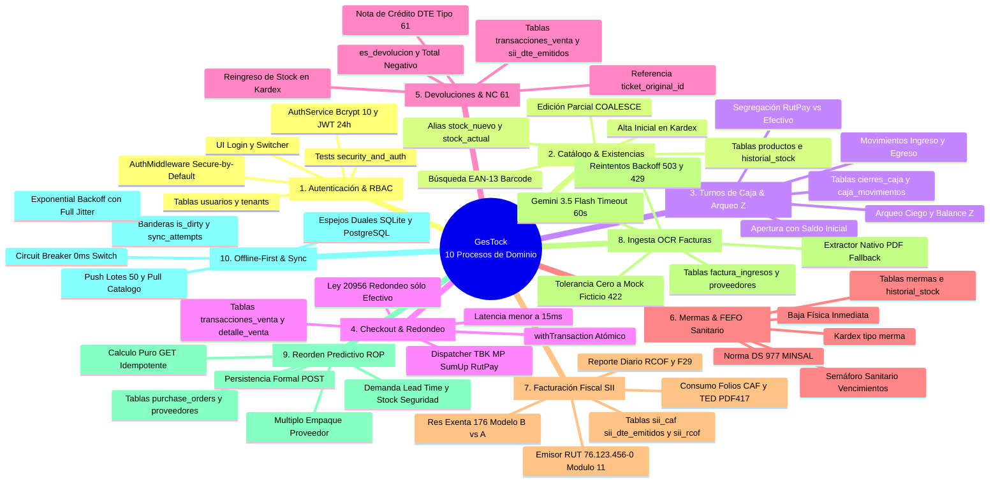

---

## 🔄 2. Detalle Exhaustivo de los 10 Procesos de Extremo a Extremo

### 2.1 Proceso 1: Autenticación, Sesión y Control de Acceso (RBAC)

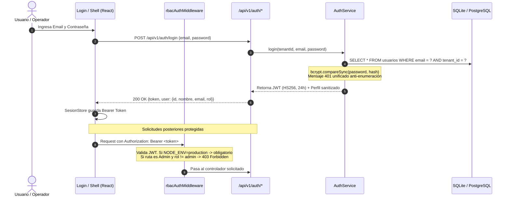

* **Vistas UI:** `src/views/LoginView.tsx`, `src/components/Navbar.tsx`, `src/store/authStore.ts`.
* **Endpoints API:**
  * `POST /api/v1/auth/login` (Público, rate-limited).
  * `POST /api/v1/auth/register` (Restringido a rol `Admin`).
  * `GET /api/v1/auth/me` (Requiere rol `Cajero` o `Admin`).
  * `GET /api/v1/auth/users` (Restringido a rol `Admin`, audita personal).
  * `PUT /api/v1/auth/password` (Cualquier usuario autenticado, cambia su propia contraseña).
* **Middleware Aplicable:** `rbacAuthMiddleware` en `backend/src/middleware/security.middleware.ts`.
  * *Regla Invariante:* En producción (`NODE_ENV=production`), la validación JWT es obligatoria por defecto salvo `AUTH_DISABLED=true`. En desarrollo se exige con `ENFORCE_AUTH=true`.
* **Servicio de Dominio:** `backend/src/auth/auth.service.ts`.
* **Persistencia:** Tablas `usuarios`, `tenants`. Hashes Bcrypt obligatorios de 60 caracteres (`$2b$10$...`).
* **Efectos Aguas Abajo:** La identidad y el rol determinan el acceso a las 11 vistas del admin o las 6 del cajero; inyecta `req.user` (`userId`, `rol`, `tenantId`) a todos los controladores.
* **Archivos Clave:**
  * [`backend/src/middleware/security.middleware.ts`](file:///g:/Proyectos/GesTock/backend/src/middleware/security.middleware.ts)
  * [`backend/src/auth/auth.service.ts`](file:///g:/Proyectos/GesTock/backend/src/auth/auth.service.ts)
  * [`backend/src/routes/auth.routes.ts`](file:///g:/Proyectos/GesTock/backend/src/routes/auth.routes.ts)
  * [`backend/src/database/init-db.ts`](file:///g:/Proyectos/GesTock/backend/src/database/init-db.ts) (parche `patchExistingDatabaseFixes()`).
* **Pruebas de Validación:**
  * `tests_unitarias/backend/security_and_auth.unit.test.ts`
  * `backend/tests/integration/auth_endpoints.test.ts`

---

### 2.2 Proceso 2: Catálogo de Productos, Alta, Edición y Búsqueda EAN-13

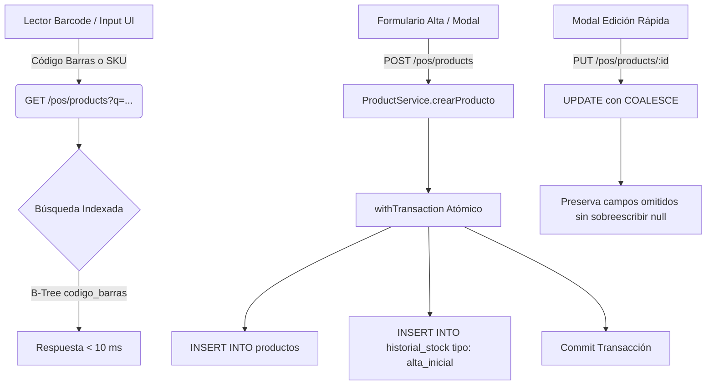

* **Vistas UI:** `src/views/PosCatalogView.tsx`, `src/views/InventoryView.tsx`, `src/components/ProductEditModal.tsx`.
* **Endpoints API:**
  * `GET /api/v1/pos/products` (Búsqueda por código de barras, nombre o SKU).
  * `POST /api/v1/pos/products` (Alta de producto, genera `alta_inicial` en Kardex).
  * `PUT /api/v1/pos/products/:id` (Modificación parcial preservando valores existentes).
  * `PATCH /api/v1/pos/products/:id/stock` (Ajuste manual de stock).
* **Servicio de Dominio:** `backend/src/pos/pos.service.ts`, `backend/src/utils/barcode.utils.ts`.
* **Reglas de Contrato Invariantes:**
  * Todo ajuste de stock debe retornar simétricamente ambos alias: `stock_nuevo` y `stock_actual`.
  * La edición mediante `PUT` utiliza sentencias SQL con `COALESCE` para no resetear a `null` campos no enviados (precio, descripción, categoría).
* **Persistencia:** Tablas `productos`, `historial_stock`.
* **Efectos Aguas Abajo:** Alterar stock impacta en tiempo real al cálculo del ROP (Reposición), al Checkout del POS y a las alertas de bajo inventario.
* **Archivos Clave:**
  * [`backend/src/routes/pos.routes.ts`](file:///g:/Proyectos/GesTock/backend/src/routes/pos.routes.ts)
  * [`backend/src/pos/pos.service.ts`](file:///g:/Proyectos/GesTock/backend/src/pos/pos.service.ts)
  * [`backend/src/utils/barcode.utils.ts`](file:///g:/Proyectos/GesTock/backend/src/utils/barcode.utils.ts)
* **Pruebas de Validación:**
  * `backend/tests/integration/products_and_stock.test.ts`
  * `tests_unitarias/frontend/frontend_contract_rules.unit.test.ts` (Sección 3 y 4).

---

### 2.3 Proceso 3: Turnos de Caja, Apertura, Movimientos y Cierre Z

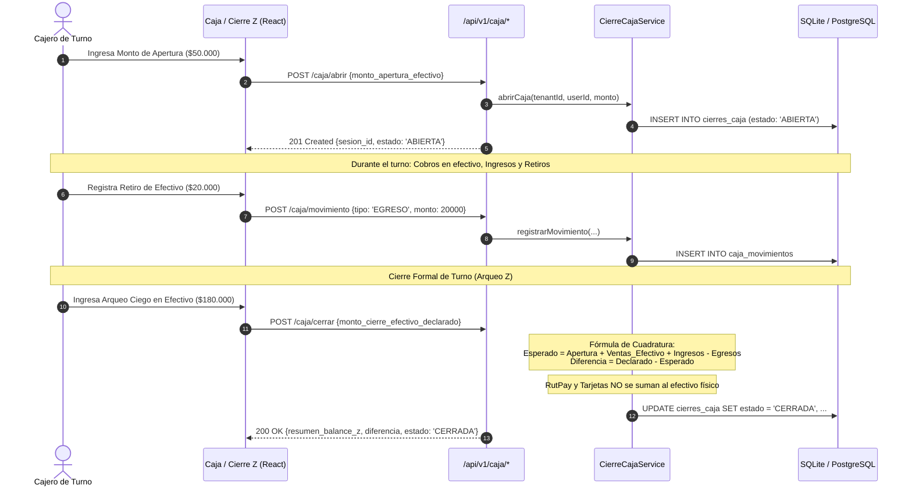

* **Vistas UI:** `src/views/CashClosingView.tsx`, `src/components/CashMovementModal.tsx`.
* **Endpoints API:**
  * `POST /api/v1/caja/abrir` (Apertura de turno con monto en efectivo).
  * `GET /api/v1/caja/resumen` (Saldo teórico acumulado del turno activo).
  * `POST /api/v1/caja/cerrar` (Arqueo ciego y generación de Balance Z).
  * `POST /api/v1/caja/movimiento` (Inyección o retiro de efectivo).
  * `GET /api/v1/caja/movimientos` (Historial de movimientos del turno).
* **Servicio de Dominio:** `backend/src/caja/cierre-caja.service.ts`.
* **Reglas de Negocio Invariantes:**
  * **Fórmula de Arqueo:** $\text{Efectivo Esperado} = \text{Monto Apertura} + \sum \text{Ventas Efectivo} + \sum \text{Ingresos} - \sum \text{Egresos}$.
  * **Segregación Estricta:** Las transacciones con tarjeta (Transbank/MP/SumUp) y transferencias directas (RutPay) se registran en canales independientes y **jamás** se computan como efectivo físico en gaveta.
  * **Resolución Automática:** Si la petición omite `sesion_id`, el backend consulta automáticamente la última sesión abierta activa del tenant.
* **Persistencia:** Tablas `cierres_caja`, `caja_movimientos`, `transacciones_venta`.
* **Archivos Clave:**
  * [`backend/src/routes/caja.routes.ts`](file:///g:/Proyectos/GesTock/backend/src/routes/caja.routes.ts)
  * [`backend/src/caja/cierre-caja.service.ts`](file:///g:/Proyectos/GesTock/backend/src/caja/cierre-caja.service.ts)
* **Pruebas de Validación:**
  * `backend/tests/integration/pricing_and_caja.test.ts`
  * `tests_unitarias/frontend/frontend_contract_rules.unit.test.ts` (Sección 2).

---

### 2.4 Proceso 4: Checkout de Venta, Cobro Multimedio y Ley de Redondeo (Ley N° 20.956)

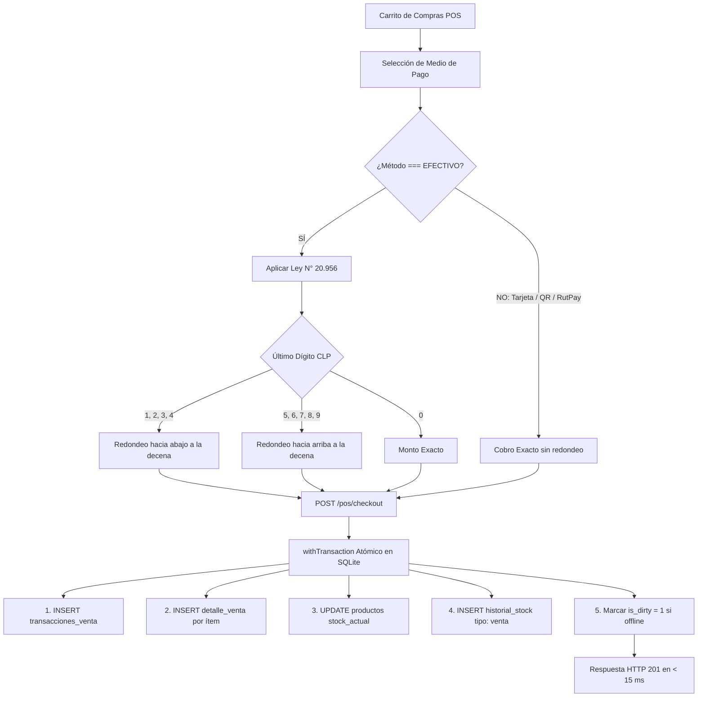

* **Vistas UI:** `src/views/PosView.tsx`, `src/components/PaymentModal.tsx`, `src/components/ReceiptPrinter.tsx`.
* **Endpoints API:**
  * `POST /api/v1/pos/checkout` (Ejecución atómica del checkout).
  * `POST /api/v1/payments/initiate` (Inicio de cobro electrónico en pasarela).
  * `POST /api/v1/payments/confirm` (Webhook o confirmación de voucher POS).
* **Servicio de Dominio:** `backend/src/pos/pos.service.ts`, `backend/src/utils/pricing.ts`, `backend/src/payments/payment-dispatcher.service.ts`.
* **Reglas Normativas Invariantes:**
  * **Ley de Redondeo (Ley N° 20.956):** Aplica **única y exclusivamente** a moneda en efectivo. Los pagos con tarjeta, QR o RutPay no admiten redondeo.
  * **Latencia de Venta:** El checkout local en SQLite debe resolverse en **menos de 15 ms** bajo `withTransaction`.
  * **Kardex Estricto:** Toda venta descuenta existencias e inserta un movimiento tipo `'venta'` en `historial_stock`.
* **Persistencia:** Tablas `transacciones_venta`, `detalle_venta`, `historial_stock`, `payment_transactions`.
* **Archivos Clave:**
  * [`backend/src/routes/pos.routes.ts`](file:///g:/Proyectos/GesTock/backend/src/routes/pos.routes.ts)
  * [`backend/src/pos/pos.service.ts`](file:///g:/Proyectos/GesTock/backend/src/pos/pos.service.ts)
  * [`backend/src/utils/pricing.ts`](file:///g:/Proyectos/GesTock/backend/src/utils/pricing.ts)
* **Pruebas de Validación:**
  * `tests_unitarias/backend/pricing_and_rounding.unit.test.ts`
  * `backend/tests/integration/pos_checkout_and_kardex.test.ts`

---

### 2.5 Proceso 5: Devoluciones, Anulaciones y Notas de Crédito (Tipo 61)

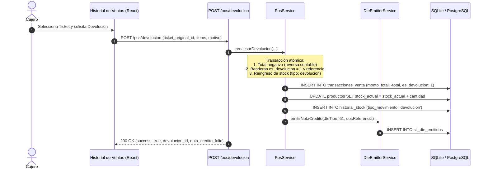

* **Vistas UI:** `src/views/SalesHistoryView.tsx`, `src/components/RefundModal.tsx`.
* **Endpoints API:**
  * `POST /api/v1/pos/devolucion` (Procesamiento de anulación o devolución).
  * `GET /api/v1/pos/transactions` (Listado de ventas con filtro `es_devolucion`).
* **Servicio de Dominio:** `backend/src/pos/pos.service.ts`, `backend/src/dte/dte-emitter.service.ts`.
* **Reglas de Negocio Invariantes:**
  * La transacción de devolución registra monto total negativo, indicador booleano `es_devolucion = 1` y referencia al ticket original.
  * El stock de los productos devueltos se reintegra al inventario bajo el tipo de movimiento `'devolucion'` en `historial_stock`.
  * Emisión obligatoria de Nota de Crédito Electrónica (DTE Tipo 61) ante el SII si la venta original tenía boleta emitida.
* **Persistencia:** Tablas `transacciones_venta`, `detalle_venta`, `historial_stock`, `sii_dte_emitidos`.
* **Archivos Clave:**
  * [`backend/src/routes/pos.routes.ts`](file:///g:/Proyectos/GesTock/backend/src/routes/pos.routes.ts)
  * [`backend/src/pos/pos.service.ts`](file:///g:/Proyectos/GesTock/backend/src/pos/pos.service.ts)
* **Pruebas de Validación:**
  * `backend/tests/integration/pos_checkout_and_kardex.test.ts`
  * `tests_unitarias/frontend/frontend_contract_rules.unit.test.ts` (Sección 5).

---

### 2.6 Proceso 6: Control de Mermas, Vencimientos (FEFO) y Trazabilidad Sanitaria

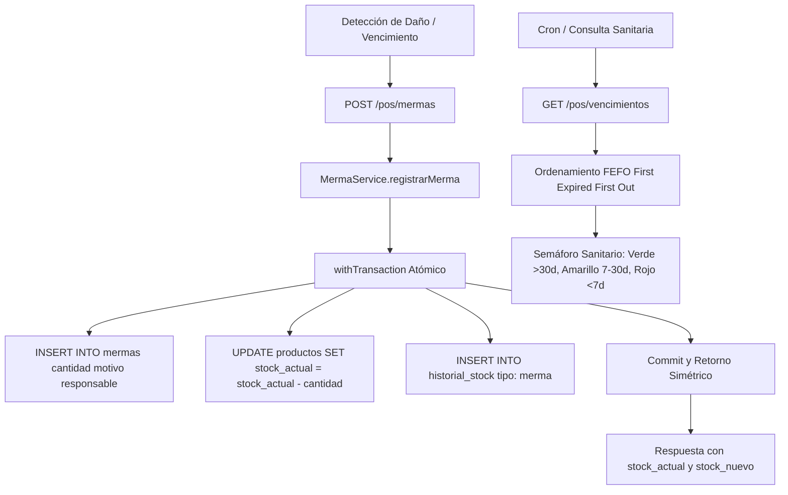

* **Vistas UI:** `src/views/MermasView.tsx`, `src/views/ExpirationsView.tsx`.
* **Endpoints API:**
  * `POST /api/v1/pos/mermas` (Registro de merma de producto).
  * `GET /api/v1/pos/mermas` (Historial y reporte exportable de mermas).
  * `GET /api/v1/pos/vencimientos` (Semáforo sanitario FEFO de lotes próximos a vencer).
* **Servicio de Dominio:** `backend/src/pos/pos.service.ts`.
* **Reglas Normativas Invariantes:**
  * **Trazabilidad Sanitaria (D.S. 977/96 MINSAL):** Gestión de existencias bajo principio FEFO (*First Expired, First Out*).
  * **Kardex Estricto:** La baja de inventario descuenta inmediatamente existencias bajo el tipo `'merma'`.
  * **Simetría de Contrato:** La respuesta de la API entrega simultáneamente `stock_actual` y `stock_nuevo`.
* **Persistencia:** Tablas `mermas`, `productos`, `historial_stock`.
* **Archivos Clave:**
  * [`backend/src/routes/pos.routes.ts`](file:///g:/Proyectos/GesTock/backend/src/routes/pos.routes.ts)
  * [`backend/src/pos/pos.service.ts`](file:///g:/Proyectos/GesTock/backend/src/pos/pos.service.ts)
* **Pruebas de Validación:**
  * `backend/tests/integration/merma_and_kardex.test.ts`
  * `tests_unitarias/frontend/frontend_contract_rules.unit.test.ts` (Sección 3).

---

### 2.7 Proceso 7: Facturación Electrónica Fiscal (DTE, CAF, TED, RCOF y F29 - SII)

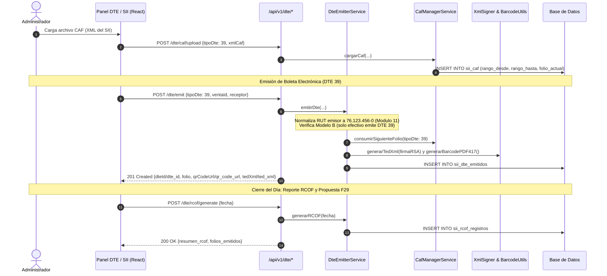

* **Vistas UI:** `src/views/DteView.tsx`, `src/views/SiiConfigView.tsx`, `src/components/ThermalReceiptModal.tsx`.
* **Endpoints API:**
  * `GET /api/v1/dte/config` (Configuración fiscal y credenciales).
  * `POST /api/v1/dte/caf/upload` (Carga y validación de XML CAF del SII).
  * `POST /api/v1/dte/emit` (Emisión y firma digital de Boleta/Factura DTE).
  * `GET /api/v1/dte/:id/receipt` (Renderizado térmico con Timbre TED PDF417).
  * `POST /api/v1/dte/rcof/generate` (Generación del reporte diario de boletas RCOF).
  * `GET /api/v1/dte/f29` (Pre-cálculo de IVA mensual y débito fiscal).
* **Servicios de Dominio:** `backend/src/dte/dte-emitter.service.ts`, `backend/src/dte/caf-manager.service.ts`, `backend/src/dte/xml-signer.service.ts`.
* **Reglas Tributarias Invariantes:**
  * **RUT Emisor Válido (Módulo 11):** El RUT oficial de prueba es `76.123.456-0`. Si la base contiene `76.123.456-7`, el servicio y el parche de arranque lo corrigen automáticamente.
  * **Resolución Exenta N° 176 (Modelo B):** En ventas con tarjeta, el comprobante de Transbank/voucher actúa legalmente como boleta; por ende, **no se emite Boleta 39** para prevenir doble débito fiscal. En efectivo sí se emite.
  * **Timbre TED:** Criptografía RSA con clave privada del CAF y representación bidimensional en PDF417.
  * **Simetría de Claves:** Respuestas con nombres duales camelCase y snake_case (`dteId`/`dte_id`, `tipoDte`/`tipo_dte`).
* **Persistencia:** Tablas `sii_caf`, `sii_dte_emitidos`, `sii_rcof_registros`, `configuracion_sistema`.
* **Archivos Clave:**
  * [`backend/src/routes/dte.routes.ts`](file:///g:/Proyectos/GesTock/backend/src/routes/dte.routes.ts)
  * [`backend/src/dte/dte-emitter.service.ts`](file:///g:/Proyectos/GesTock/backend/src/dte/dte-emitter.service.ts)
  * [`backend/src/dte/caf-manager.service.ts`](file:///g:/Proyectos/GesTock/backend/src/dte/caf-manager.service.ts)
* **Pruebas de Validación:**
  * `tests_unitarias/backend/dte_crypto_rules.unit.test.ts`
  * `backend/tests/integration/dte_emission_and_caf.test.ts`

---

### 2.8 Proceso 8: Ingesta Inteligente de Facturas de Compra (Gemini OCR, Extractor Nativo & Anti-Mock)

```mermaid
flowchart TD
    A[Subida de Factura PDF / Imagen] --> B[POST /invoices/scan]
    B --> C[OcrDispatcherService.dispatch]
    
    C --> D{¿GEMINI_API_KEY activa?}
    D -->|SÍ| E[Llamada a Google Gemini 3.5 Flash]
    E --> F{¿Respuesta Exitosa?}
    F -->|SÍ| G[Parseo Estructurado de Factura]
    F -->|Fallo 503/429| H[Hasta 3 Reintentos con Backoff Exponencial 1s, 2s]
    H -->|Fallo Persistente| I[Conmutar a Extractor Nativo PDF ChileanPdfDteExtractor]
    
    D -->|NO / Archivo PDF Local| I
    
    I --> J{¿Texto Extraído?}
    J -->|SÍ: Cabecera y Total| G
    J -->|NO| K{¿hasApiKey || isProduction?}
    K -->|SÍ| L[Error Honesto HTTP 422 Unprocessable Entity<br>TOLERANCIA CERO A DATOS FICTICIOS]
    K -->|NO: Test local| M[MockOcrProvider solo si simulateFailure]
    
    G --> N[Revisión en UI y POST /invoices/confirm]
    N --> O[withTransaction Atómico]
    O --> P[1. Crear/Actualizar Proveedor]
    O --> Q[2. Inserción de Productos Nuevos o Actualización de Costos]
    O --> R[3. Incremento de Stock e Historial Kardex tipo: ingreso_factura]
    O --> S[4. Guardar factura_ingresos con banderas is_dirty = 0]
```

* **Vistas UI:** `src/views/InvoiceOcrView.tsx`, `src/components/InvoiceConfirmationModal.tsx`.
* **Endpoints API:**
  * `POST /api/v1/invoices/scan` (Extracción multimodal con timeout extendido de 60s).
  * `POST /api/v1/invoices/confirm` (Confirmación e impacto atómico en el Kardex e inventario).
  * `POST /api/v1/invoices/ingest` (Ingesta directa de factura estructurada).
  * `GET /api/v1/invoices/` (Historial de facturas procesadas).
* **Servicio de Dominio:** `backend/src/ocr/ocr-dispatcher.service.ts`, `backend/src/ocr/gemini-ocr.provider.ts`, `backend/src/ocr/pdf-invoice.extractor.ts`, `backend/src/invoices/invoice-ingestion.service.ts`.
* **Reglas de Calidad e Integridad Invariantes:**
  * **Tolerancia Cero a Datos Simulados:** Cuando existe `GEMINI_API_KEY` o se corre en producción, el simulador `MockOcrFallback` queda **terminantemente prohibido**. Ante falla total se responde HTTP 422 para no contaminar el Kardex con proveedores inventados ("DISTRIBUIDORA CENTRAL").
  * **Resiliencia:** Reintentos con retroceso exponencial ante 503/429. Si falla Gemini, conmuta al extractor nativo de PDF.
  * **Columnas Offline-First:** La tabla `factura_ingresos` incorpora `is_dirty`, `sync_status` y `sync_attempts`.
* **Persistencia:** Tablas `factura_ingresos`, `proveedores`, `productos`, `historial_stock`.
* **Archivos Clave:**
  * [`backend/src/routes/invoice.routes.ts`](file:///g:/Proyectos/GesTock/backend/src/routes/invoice.routes.ts)
  * [`backend/src/ocr/ocr-dispatcher.service.ts`](file:///g:/Proyectos/GesTock/backend/src/ocr/ocr-dispatcher.service.ts)
  * [`backend/src/invoices/invoice-ingestion.service.ts`](file:///g:/Proyectos/GesTock/backend/src/invoices/invoice-ingestion.service.ts)
* **Pruebas de Validación:**
  * `backend/tests/integration/invoice_ocr_ingestion.test.ts`
  * `backend/tests/integration/ocr_resilience.test.ts`

---

### 2.9 Proceso 9: Reorden Predictivo Idempotente (ROP) y Órdenes de Compra

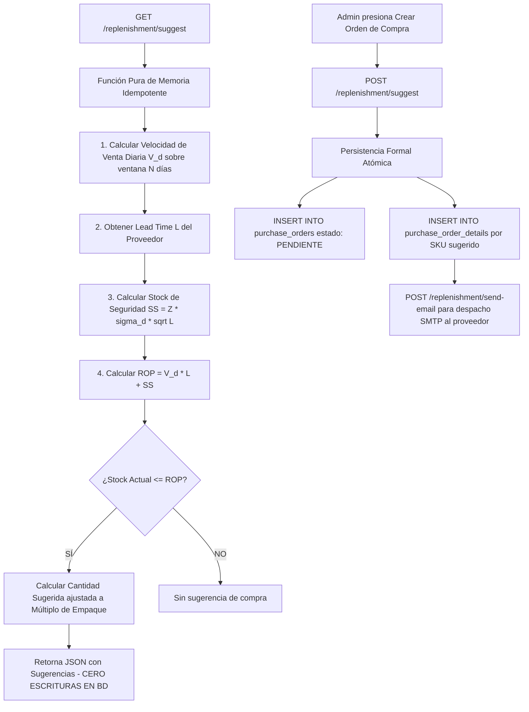

* **Vistas UI:** `src/views/ReplenishmentView.tsx`, `src/views/SuppliersView.tsx`.
* **Endpoints API:**
  * `GET /api/v1/replenishment/suggest` (Consulta pura en memoria de productos bajo el punto de reorden).
  * `POST /api/v1/replenishment/suggest` (Persistencia formal de la orden de compra).
  * `GET /api/v1/replenishment/velocity` (Velocidad histórica de consumo por SKU).
  * `POST /api/v1/replenishment/send-email` (Despacho de la orden por correo al proveedor).
* **Servicio de Dominio:** `backend/src/replenishment/replenishment.service.ts`, `backend/src/suppliers/supplier.service.ts`.
* **Modelo Matemático e Invariantes:**
  * **Fórmula ROP:** $ROP = (V_d \times L) + SS$.
  * **Principio de Idempotencia Estricta:** `GET /suggest` jamás escribe en base de datos; es una consulta segura y repetible. `POST /suggest` es el responsable exclusivo de la inserción transaccional en `purchase_orders`.
  * **Múltiplo de Empaque:** Si el proveedor exige cajas de 12 unidades y faltan 5, la sugerencia se ajusta hacia arriba a 12.
* **Persistencia:** Tablas `purchase_orders`, `purchase_order_details`, `proveedores`, `productos`.
* **Archivos Clave:**
  * [`backend/src/routes/replenishment.routes.ts`](file:///g:/Proyectos/GesTock/backend/src/routes/replenishment.routes.ts)
  * [`backend/src/replenishment/replenishment.service.ts`](file:///g:/Proyectos/GesTock/backend/src/replenishment/replenishment.service.ts)
* **Pruebas de Validación:**
  * `tests_unitarias/backend/replenishment_math.unit.test.ts`
  * `backend/tests/integration/replenishment_and_suppliers.test.ts`

---

### 2.10 Proceso 10: Resiliencia Offline-First, Circuit Breaker (0 ms) y Sincronización Asíncrona

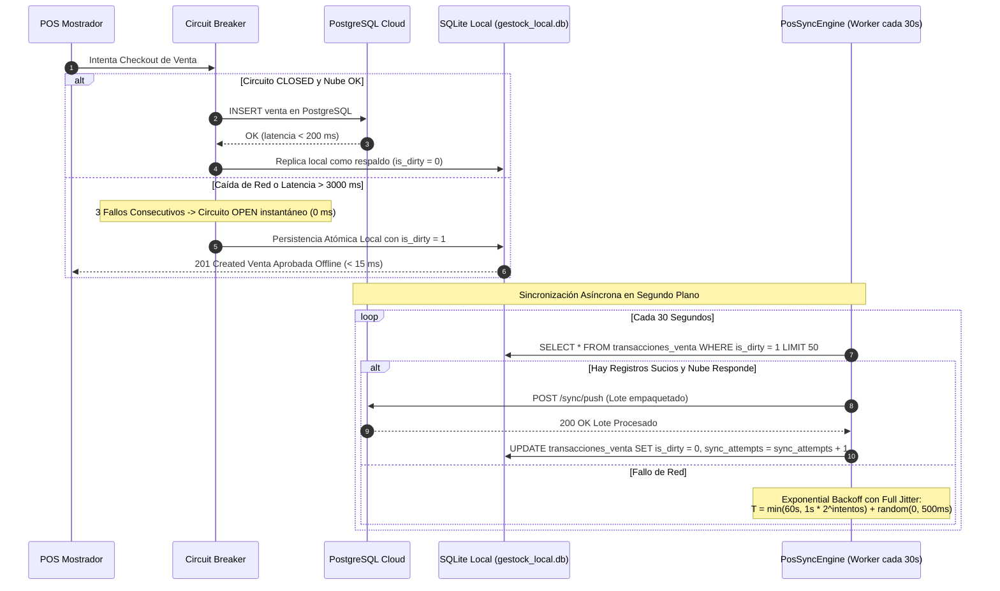

* **Vistas UI:** `src/components/NetworkStatusIndicator.tsx`, `src/components/SyncNowButton.tsx`.
* **Endpoints API:**
  * `GET /health` (Estado del sistema: `UP` o `DEGRADED`, sondeo de bases de datos).
  * `POST /api/v1/pos/sync` (Fuerza la ejecución inmediata de la sincronización local).
  * `POST /api/v1/sync/push` (Receptor cloud de transacciones sucias del POS).
  * `GET /api/v1/sync/pull` (Descarga novedades del catálogo central hacia el POS local).
* **Servicio de Dominio:** `backend/src/database/circuit-breaker.ts`, `backend/src/sync/pos-sync-engine.service.ts`, `backend/src/database/postgres/client.ts`, `backend/src/database/sqlite/client.ts`.
* **Reglas de Ingeniería Invariantes:**
  * **Conmutación en 0 ms:** Ante 3 fallos o timeout > 3000 ms, el circuito se abre y desvía todo a SQLite local sin bloquear al cajero.
  * **Integridad PRAGMA:** SQLite opera obligatoriamente con `PRAGMA foreign_keys = ON;`.
  * **Anti-Thundering Herd:** Reintentos regulados por fórmula de backoff exponencial con Full Jitter.
  * **Diagnóstico de Conexión:** En `PostgresClient.healthCheck()`, desglosa los errores de socket (`ECONNREFUSED`) en lugar de reportar objetos vacíos.
* **Persistencia:** Tablas `transacciones_venta`, `detalle_venta`, `factura_ingresos` (espejos duales).
* **Archivos Clave:**
  * [`backend/src/database/circuit-breaker.ts`](file:///g:/Proyectos/GesTock/backend/src/database/circuit-breaker.ts)
  * [`backend/src/database/postgres/client.ts`](file:///g:/Proyectos/GesTock/backend/src/database/postgres/client.ts)
  * [`backend/src/sync/pos-sync-engine.service.ts`](file:///g:/Proyectos/GesTock/backend/src/sync/pos-sync-engine.service.ts)
  * [`backend/src/routes/sync.routes.ts`](file:///g:/Proyectos/GesTock/backend/src/routes/sync.routes.ts)
* **Pruebas de Validación:**
  * `tests_unitarias/backend/circuit_breaker.unit.test.ts`
  * `backend/tests/integration/sqlite_schema.test.ts`
  * `backend/tests/integration/pos_sync_engine.test.ts`

---

## ⚡ 3. Matriz de Impacto Cruzado y Dependencias Aguas Abajo

Cuando se introduce un cambio en una entidad o módulo del sistema, el desarrollador **debe auditar los procesos vinculados** para evitar regresiones silenciosas:

| Si modificas este Módulo / Entidad... | Impacta Directamente en estos Procesos... | Puntos Críticos y Reglas a Verificar |
|---|---|---|
| **`productos` / Stock** | P2 (Catálogo), P4 (Checkout), P6 (Mermas), P8 (OCR), P9 (ROP) | • Respuestas deben entregar simétricamente `stock_nuevo` y `stock_actual`.<br>• Todo cambio debe insertar en `historial_stock` con uno de los 6 tipos válidos.<br>• Actualizaciones parciales en `PUT` deben usar `COALESCE`. |
| **`usuarios` / `tenants`** | P1 (Autenticación), Todos los módulos protegidos | • Respetar política *secure-by-default* en producción.<br>• Contraseñas siempre con hash Bcrypt de 60 caracteres (costo 10).<br>• Registro restringido exclusivamente a administradores.<br>• Nunca exponer `password_hash` en JSON de respuesta. |
| **`cierres_caja` / Caja** | P3 (Caja Z), P4 (Checkout en Efectivo) | • No mezclar tarjetas o RutPay con el efectivo físico en gaveta.<br>• Si la petición no envía `sesion_id`, resolver la sesión activa abierta.<br>• Fórmula de cuadratura matemática: Apertura + Ventas + Ingresos - Egresos. |
| **`sii_dte_emitidos` / CAF** | P4 (Checkout DTE), P5 (Devolución NC 61), P7 (SII DTE) | • RUT emisor debe ser `76.123.456-0` (Módulo 11).<br>• En ventas con tarjeta (Modelo B) NO emitir Boleta 39 (Res. Exenta 176).<br>• Respuestas con alias duales: camelCase y snake_case.<br>• Generación fiel de código de barras PDF417 para TED. |
| **`factura_ingresos` / OCR** | P8 (Ingesta OCR), P2 (Catálogo), P10 (Offline Sync) | • Prohibido usar `MockOcrProvider` si hay API key o en producción.<br>• Responder HTTP 422 honesto ante imposibilidad de extracción.<br>• Conservar banderas offline-first (`is_dirty`, `sync_status`, `sync_attempts`). |
| **`purchase_orders` / ROP** | P9 (Reposición), P8 (Facturación de Proveedores) | • `GET /suggest` debe mantenerse como función pura e idempotente (cero escrituras).<br>• Solo `POST /suggest` persiste órdenes de compra formales.<br>• Respetar múltiplos de empaque del proveedor. |
| **Capa de Persistencia Dual** | P10 (Sync / Circuit Breaker), P4 (Checkout POS) | • Latencia en SQLite < 15 ms con `withTransaction`.<br>• Forzar `PRAGMA foreign_keys = ON;` al abrir conexión SQLite.<br>• Conmutación a SQLite en 0 ms si PostgreSQL no responde en 3000 ms.<br>• Registro informativo de desconexión sin objetos `AggregateError` vacíos. |

---

## 🛠️ 4. Protocolo de Intervención de Código (Impact Analysis Workflow)

Antes y durante cualquier modificación en GesTock, el asistente o ingeniero seguirá este ciclo de 5 pasos:

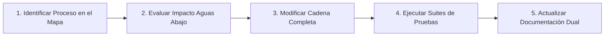

1. **Paso 1: Localización del Proceso:** Identificar a cuál de los 10 procesos de dominio pertenece la petición o el bug a resolver.
2. **Paso 2: Análisis de Impacto Aguas Abajo:** Consultar la *Matriz de Impacto Cruzado* (§3) para listar todas las tablas, rutas y servicios que dependen del componente a editar.
3. **Paso 3: Modificación de la Cadena Completa:** Nunca realizar cambios aislados que rompan contratos. Si se cambia un modelo o nombre de atributo, actualizar simétricamente:
   * Esquema SQL y migraciones (PostgreSQL y SQLite).
   * Interfaces y tipos TypeScript en `src/`.
   * Rutas y controladores con alias de retrocompatibilidad.
   * Entidades y validaciones en la capa de frontend.
4. **Paso 4: Verificación con Pruebas Automatizadas:** Ejecutar inmediatamente las suites específicas del proceso (`npm run test:unit:backend`, `npm run test:unit:frontend` y/o `npm test`). No dar por resuelto ningún cambio sin 100% de tests pasando.
5. **Paso 5: Actualización de Documentación Dual y Memoria:** Reflejar los cambios en `docs/ARQUITECTURA_SISTEMA.md` (y su `.docx`), en la nota de solución en Obsidian (`03 - SOLUCIONARIO & TROUBLESHOOTING/`) y en `05 - MEMORIA & APRENDIZAJES IA/⚡ INDICE_SOLUCIONES_RAPIDAS.md`.
